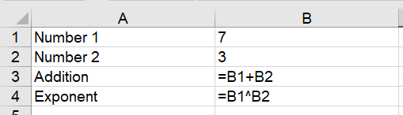
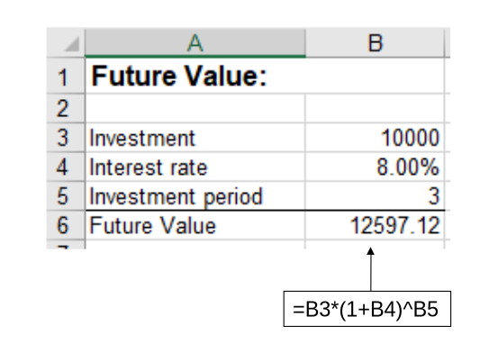
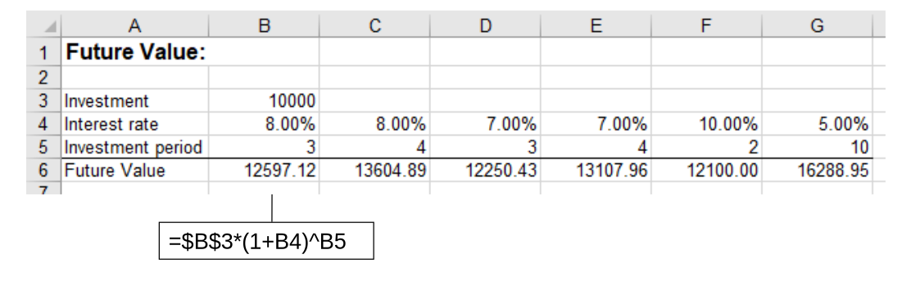
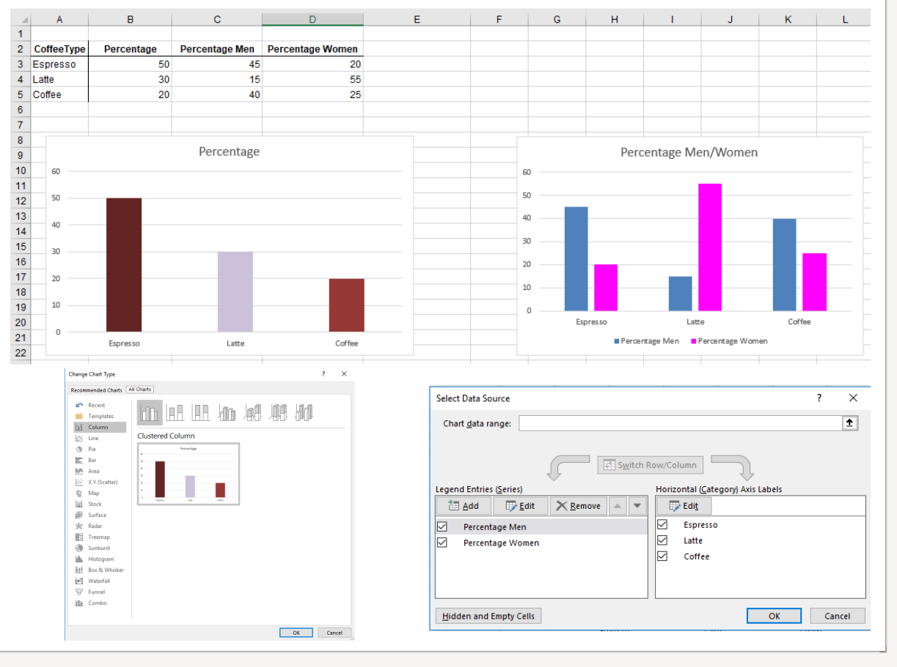
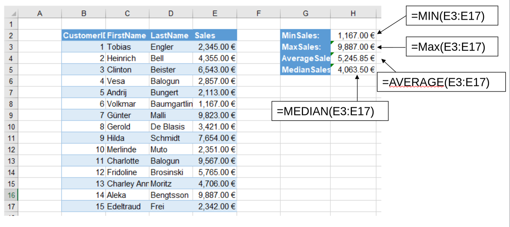
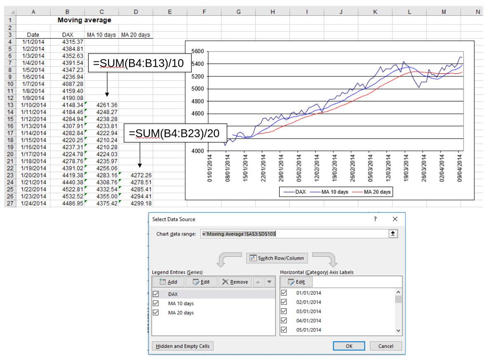
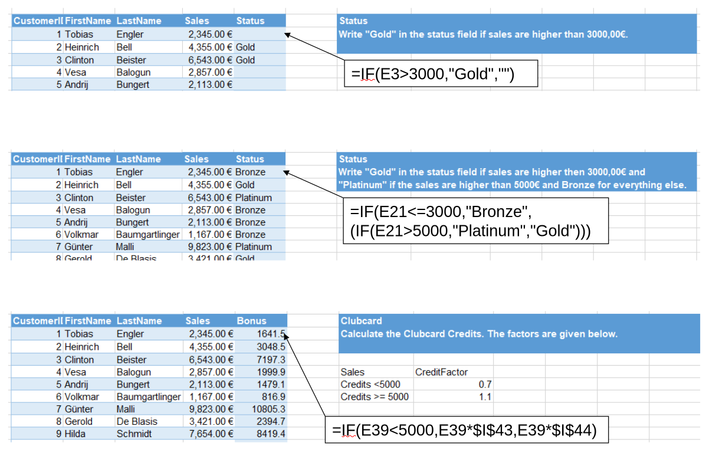
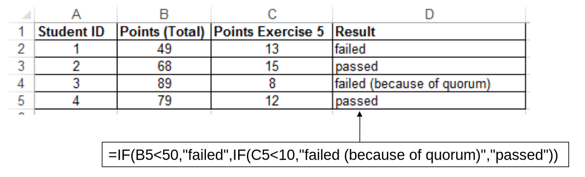

In-class exercise sheet: [Excel_Exercises_in_class_session_1.xlsx](../materials/Excel_Exercises_in_class_session_1.xlsx)

| Time                 | Topic/activity                                             | Materials                                                            |
| -------------------: | ---------------------------------------------------------- | -------------------------------------------------------------------- |
| 0–15 min             | Introduction and organization                              | [Introductory slides](../slides/session_00_orga.qmd) (separate)      |
| 15–35 min            | Excel basics, formulas, and cell references                | Slides 1–6 [introduction.xlsx: sheet start](../materials/introduction.xlsx) |
| 35–55 min            | Future-value calculation                                   | Slides 7–10 Slides 7 and 10: Exercise **Future value**            |
| 55–70 min            | Data handling and chart selection                          | Slides 11–14 Slide 14: Exercise **Coffee-shop charts**            |
| 70–90 min            | Functions and descriptive statistics                       | Slides 15–19 Slide 19: Exercise **Sales statistics**              |
| **Break**            |                                                            |                                                                      |
| 0–15 min             | Explain the moving-average task and expected output        | Slide 20 Take-home exercise **DAX moving averages**               |
| 15–35 min            | Conditional logic and customer classification              | Slides 21–23 Slide 23: Exercise **VIP status**                    |
| 35–50 min            | Conditional calculations                                   | Slide 24: Exercise **VIP club credits**                              |
| 50–70 min            | Work through the installment-loan calculation on the board | Slide 25: Take-home exercise **Installment loan**                    |
| 70–82 min            | Annuity loans and the `PMT` function                       | Slide 26: Exercise **Annuity loan**                                  |
| 82–90 min            | Exam-result classification and wrap-up                     | Slides 27–28 Slide 27: Exercise **Exam result**                   |



## Slide 1 - Excel basics

Use [introduction.xlsx](../materials/introduction.xlsx) for the following.
<!-- see [solution](../materials/introduction_with_solutions.xlsx) -->

{fig-align="center" width="50%"}

- Entering formulas in the cell or the bar
- Selecting cells by typing "=A1+A2" vs. by clicking on cells
- Anticipate changes (based on discussions/feedback), extensions of Excel sheets (need for proper design)

::: {.callout-tip title="Pro tips"}

Expect that Excel spreadsheets will contain errors.
Always check and debug: for the exercises, but also in your job, when you build an Excel spreadsheet or when you get one from a colleague.

- Show formula mode
- Shortcut: `ctrl`+`shift`+`` ` ``
- Show predecessor/successor visually
- Show calculations (stopped?)
:::

## Slide 7: Future Value (first exercise)

Task: Create a first spreadsheet and create the formula for future value.

Solution:

{fig-align="center" width="50%"}

## Slide 8: Referencing cells:

[introduction.xlsx sheet 2](../materials/introduction.xlsx): Kosten-Erlösrechnung

**TODO: switch to english and add screenshot here**

## Slide 10 - Future Value (second exercise)

Solution:

{fig-align="center" width="80%"}

## Slide 14

{fig-align="center" width="90%"}

## Slide 16 — Formula syntax and functions

- Show graphical Formulas selection (areas: ...)
- Demonstrate the function-argument separator.
- Examples (at the bottom): how many parameters are there in each function?
- Explicitly distinguish between a **formula** and a **function**.

::: {.callout-important title="Test Excel configuration"}
Test requirement: **For `SUM(3,5)`: everyone should have `8` as the result.**
This ensures that language is set to English and parameters are separated by `,`.

- English: Make sure Excel is in English (File -> Options -> Language; restart)
- Separator:

    1. Close Excel.
    2. Press **`Win` + `R`**.
    3. Enter **`intl.cpl`** and press Enter.
    4. Click **Additional settings… / Weitere Einstellungen…**
    5. Under **Numbers / Zahlen**, set:

    * **Decimal symbol / Dezimaltrennzeichen:** `.`
    * **Digit grouping symbol:** `,`
    * **List separator / Listentrennzeichen:** `,`
    6. Confirm with **OK** and restart Excel.

    In Excel, ensure **File → Options → Advanced → Use system separators** remains enabled.

:::

## Slide 19 - Sales statistics

{fig-align="center" width="90%"}

## Slide 20 — DAX moving averages (before or after the break)

- First take-home exercise.

- Explain the figure, then the formula, and then ask students how the spreadsheet should look like (draft column-names, maybe where the formulas start, but not the specific formula solutions)
- Draft structure on the blackboard
- Last step: create the visualization...

#

## Slide 21 - IF Dialogue

Opens when selecting ribbon Formulas, Logical, IF

::: {.teaching-break}
☕ Break — 10 minutes
:::

**TODO: include illustration here, explain the problem well! (PR?)**

## Slides 23–24 — VIP classification and credits

- Prefer nested `IF` functions for the VIP-status exercise (in part II).

## Slide 25 — Installment loan

- Work through the repayment logic on the board.
- Students then transfer the calculation to Excel as a take-home exercise.
- From period 2 onward, repayment requires an `IF` condition.
- Students should identify the need for the condition themselves.
- Allow sufficient explanation because this exercise has caused difficulties in previous cohorts.

`The repayment equals the fixed repayment amount or, when the remaining debt is lower, the remaining debt.`

**TODO: include visualization here (PR?)**

## Slide 27 Exam

## Slide 28: Special IF functions

TBD

## Summary and announcements (next session)

TODO / TBD: reflection/questions for next sesssion?

::: {.callout-note title="Pro tips"}
- Use keyboard instead of clicking (prepare/mention shortcuts)
- Relative/absolute references: debug formula (predecessor/successor visualization)
:::

::: {.callout-tip title="Notes for improvement"}
Take notes on a separate paper and add to `feedback.qmd` after the session.
:::

<!--
    ## Session overview

    - **Focus:** Excel
    - **Session title:** Excel 1
    - **Coverage target:** TBD

    ## Before class

    - [ ] Review the session slides/materials.
    - [ ] Prepare files, datasets, and examples.
    - [ ] Note any announcements or reminders.

    ## Timing record

    Use this table while preparing or after teaching to record the actual timing.

    | Planned time | Actual time | Topic/activity | Notes for next time |
    |---|---|---|---|
    | 0--10 min |  | Setup / recap |  |
    | 10--30 min |  | Main input |  |
    | 30--60 min |  | Guided practice |  |
    | 60--80 min |  | Independent practice / questions |  |
    | 80--90 min |  | Wrap-up |  |

    ## Notes during class

    - TBD

    ## Follow-up

    - [ ] Update examples or instructions.
    - [ ] Record common questions.
    - [ ] Add reminders for the next session.
-->