 

| Time                 | Topic/activity                                               | Materials                                                          |
| -------------------: | ------------------------------------------------------------ | ------------------------------------------------------------------ |
| 0–15 min             | Introduction and organization                              | [Introductory slides](../slides/session_00_orga.qmd) (separate)      |
| 15–35 min            | Excel basics, formulas, and cell references                | Slides 1–6                                                        |
| 35–55 min            | Future-value calculation                                   | Slides 7–10 Slides 7 and 10: Exercise **Future value**            |
| 55–70 min            | Data handling and chart selection                          | Slides 11–14 Slide 14: Exercise **Coffee-shop charts**            |
| 70–90 min            | Functions and descriptive statistics                       | Slides 15–19 Slide 19: Exercise **Sales statistics**              |
| **Break**            |                                                            |                                                                      |
| 0–15 min             | Explain the moving-average task and expected output        | Slide 20 Homework **DAX moving averages**                         |
| 15–35 min            | Conditional logic and customer classification              | Slides 21–23 Slide 23: Exercise **VIP status**                    |
| 35–50 min            | Conditional calculations                                   | Slide 24: Exercise **VIP club credits**                              |
| 50–70 min            | Work through the installment-loan calculation on the board | Slide 25: Homework **Installment loan**                              |
| 70–82 min            | Annuity loans and the `PMT` function                       | Slide 26: Exercise **Annuity loan**                                  |
| 82–90 min            | Exam-result classification and wrap-up                     | Slides 27–28 Slide 27: Exercise **Exam result**                   |

: {tbl-colwidths="[20,40,40]"}

::: {.callout-tip title="Excel language settings"}
Students should configure Excel to use **English function names** and **comma separators**:

{fig-align="center" width="18%"}
:::

::: {.callout-note}
Open:

- PPTX in VM
- Excel: `exercises.xlsx` in VM (save a copy for the group to track its progress)
:::

## Introductory remarks

Start with a strong focus on programming (I love programming/Github stats, first student assistant job, ..., student coauthors, but also: teaching it in an accessible way; move research interests to the end: theses)

Getting to know students

Programming:

- Definition
- Think: what does that involve? what makes a program good?
- Illustrate with StreetComplete:
  - Instructions to handle the map data
  - Instructions to display (layout, like IPhone App experience)
  - Instructions to validate and integrate
  - Testing: automated tests - does the menu still open, is the map still displayed, can users still log in?
  - Testing: user tests (feedback on bugs, improvements, ...)
  - Testing: peer review (readability, understanding code, taking responsibility for code)
- Chatgpt: ask for student votes and a few reactions (arguments)
- Highlight:
  - Testing (ChatGPT makes errors): requires real-world experience (assumptions/requirements, typical interactions, events/exceptions that could be expected)
  - Understanding becomes the new bottleneck (not just generating code) - indeed, large code-bases that are hard to assess in their entirety can be a problem.
  - ChatGPT performs better when we know more about programming and give more precise instructions, recognize problems
  - Responsibility (especially in mission-critical software) becomes more important

### Course structure

- Sit in rows where you can read the screen well
- Show **excercises.xlsx** in Canvas for Download.
- Tutoring sessions start with the **Python** part of the course.

::: {.callout-note}
Any questions?
:::

### For a successful course

I hope you enjoy the course, learn a lot, and develop skills you can actually use.

* **Develop a good learning rhythm early.** Work consistently and aim to understand and solve the tasks yourself.
* **Expect errors.** They are a normal part of programming and learning: test, understand, revise, and try again.
* **Do not work in isolation.** Form learning groups, compare solutions, and support each other.
* **Ask questions—again and again.** In class, in tutorials, and whenever something remains unclear.
* **Use the support available.** Our tutors do an excellent job and are there to help you.
* **Keep going.** Perseverance and genuine understanding are the best preparation for success in the course and exams.

## Slide 1 - Excel basics

In the Excel part, we have two goals:

- Using Excel competently (references, formulas, pivot tables)
- Structuring business problems to solve them effectively (~ programming)

Start Excel and explain the following (without slides):

::: {.teaching-file}
[In-class demo]{.teaching-label .teaching-label-demo} [`../materials/exercises.xlsx`](../materials/exercises.xlsx){.teaching-button .teaching-button-demo} -- Sheet: Start
:::
<!-- see [solution](../materials/exercises_with_solutions.xlsx) -- Sheet: Start -->

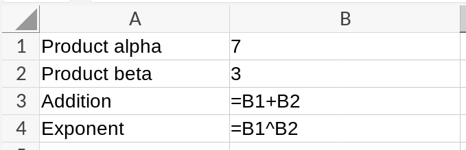{fig-align="center" width="50%"}

- Rows, columns, cells, entering values like numbers, text, boolean values
- Entering formulas in the cell or the bar
- Selecting cells by typing "=A1+A2" vs. by clicking on cells
- Some cells are used for entering data, others for formulas (we need to understand which type of cell is needed)
- Illustrate data types: Add "€" to the numbers and show that the SUM/EXP no longer work.

Important: distinguish

- Data cells (plain values)
- Calculated cells (formulas)

## Slide 7: Future Value (first exercise)

::: {.teaching-file}
[In-class exercise]{.teaching-label .teaching-label-exercise} [`../materials/exercises.xlsx`](../materials/exercises.xlsx){.teaching-button .teaching-button-exercise} -- Sheet: Future_Value
:::

Task: Download the `exercises.docx` from Canvas and solve the first sheet: `Future_Value`.

Illustration:

- 100€ - 5% interest
- 100€ * 0.05 = 5€ earned
- 100€ * 1.05 = 105 € amount after year 1
- 100€ * 1.05 * 1.05 = .... amount after year 2
- ...
- 100€ * 1.05^n

Reminder: "Scenarios" means that some cells are data cells that we want to change to automatically see what the updated outcome is.

Solution:

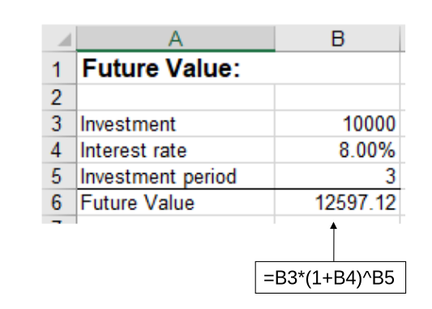{fig-align="center" width="50%"}

<!--
::: {.callout-tip title="Pro tips"}
Use keyboard instead of clicking (prepare/mention shortcuts)
:::
-->

::: {.callout-note}
Next: Sheet `Cost_Revenue` (slides only afterwards).
:::

## Slide 8: Referencing cells (example: cost revenue calculation)

::: {.callout-note}
Remind students to raise questions when anything is unclear.
:::

**Key insight**: To copy formulas, we need to use appropriate relative, absolute, mixed references.
 
Setup:

- Illustrate as a first example business (e.g., coffee cups).
- Overall production/sales is on the left, per unit on the right.
- Remember: we calculate per-unit reveue once and then reference it (instead of hardcoding)

- Step 1: Write all formulas by hand. Point out that this will take long and likely introduce errors. Solution: copying formulas (Excel will automatically update the references)
- Step 2: Clarify expectation (24000 in the next cell). Write the revenue formula and copy the fomula down. Value does not match. Use the `Formulas > Trace precedents` to show that it uses the right values
- Step 3: Illustrate use of an absolute reference, update cells, verify results. (Use `F4` to switch reference type.)

::: {.teaching-file}
[In-class demo]{.teaching-label .teaching-label-demo} [`../materials/exercises.xlsx`](../materials/exercises.xlsx){.teaching-button .teaching-button-demo} -- Sheet: Cost_Revenue
:::

Solution:

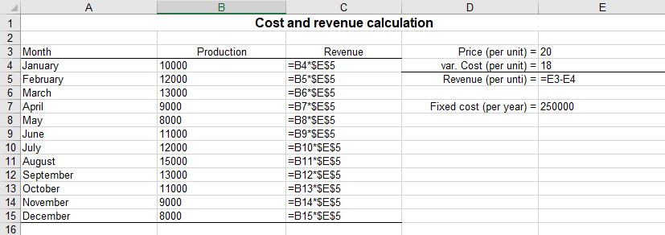{fig-align="center" width="100%"}

::: {.callout-note title="Write on the blackboard"}
| Reference               | Example | Copying right     | Copying down      |
| ----------------------- | ------- | ----------------- | ----------------- |
| Relative                | `A1`    | `B1`, `C1`, …     | `A2`, `A3`, …     |
| Absolute                | `$A$1`  | `$A$1`, `$A$1`, … | `$A$1`, `$A$1`, … |
:::

**Highlight**: Need to anticipate how a formula will be copied to use relative vs. absolute references appropriately.

## Slide 10 - Future Value (second exercise)

::: {.teaching-file}
[In-class exercise]{.teaching-label .teaching-label-exercise} [`../materials/exercises.xlsx`](../materials/exercises.xlsx){.teaching-button .teaching-button-exercise} -- Sheet: Future_Value2
:::

<!-- **Note**: practice absolute references before introducing mixed references. -->

**Show slide 10**.

**Explanation**: The "Scenario analysis" will be done in separate columns. The investment of `10000` remains the same.

**Highlight**: We want to copy the formula to the right.

Solution:

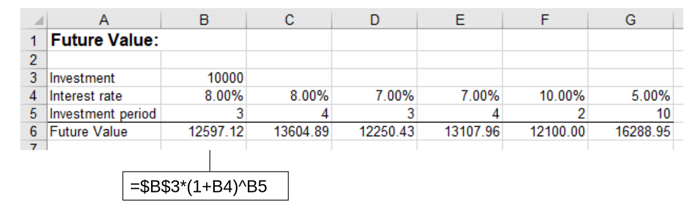{fig-align="center" width="80%"}

::: {.callout-note title="Exam advice"}
Note: Write all formulas below in such a way that they can be copied down/right without modification.
Hard-coding numbers in formulas for which there exist data cells in the sheet is considered a mistake.

Highlight that **copied down/right** is important - illustrate what **without modification** means (e.g., copying down an absolute reference that should be relative/mixed), give examples for **hard-coding values**.
:::

::: {.callout-tip title="Pro tips"}

Expect that Excel spreadsheets will contain errors.
Always check and debug: for the exercises, but also in your job, when you build an Excel spreadsheet or when you get one from a colleague.

- Show formula mode (`ctrl`+`shift`+`` ` ``)
- Show predecessor/successor visually
- Show calculations (stopped?)
:::

## Slide 8: Continued example

::: {.callout-note title="Shortcuts"}
- `alt`+`m`+`p` : show precedents
- `alt`+`m`+`a`+`Enter' : hide
:::

- Step 4: extend example: Cost depends two dimensions: assume I am a painter and paint appartments of different sizes with different colors (I will paint your appartment, penthouse etc. with the color you like, base colors are cheap, others more expensive, so it depends on both: size and color). Complex - we need an Excel table to understand what to charge. (small/medium/large  - no square meters, I see it immediately; if you order something with patterns, I will be rich). Illustrate formula copying **to the whole table** (sizes will always in column XXX, so make XXX absolute. Prices will always be in row YYY, so make YYY absolute.)
- Check: understanding/questions?

::: {.teaching-file}
[In-class demo]{.teaching-label .teaching-label-demo} [`../materials/exercises.xlsx`](../materials/exercises.xlsx){.teaching-button .teaching-button-demo} -- Sheet: Cost_Revenue_Painter
:::

Solution:

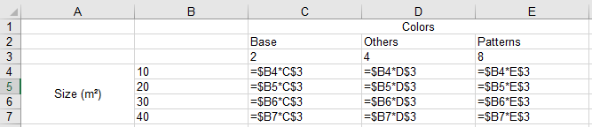{fig-align="center" width="100%"}

::: {.callout-note title="Update the blackboard"}
| Reference               | Example | Copying right     | Copying down      |
| ----------------------- | ------- | ----------------- | ----------------- |
| Mixed — absolute column | `$A1`   | `$A1`, `$A1`, …   | `$A2`, `$A3`, …   |
| Mixed — absolute row    | `A$1`   | `B$1`, `C$1`, …   | `A$1`, `A$1`, …   |
:::

**Show the table on the slide afterwards**

## Slide 13 - Charts illustration

::: {.teaching-file}
[In-class demo]{.teaching-label .teaching-label-demo} [`../materials/exercises.xlsx`](../materials/exercises.xlsx){.teaching-button .teaching-button-demo} -- Sheet: with_plot
:::

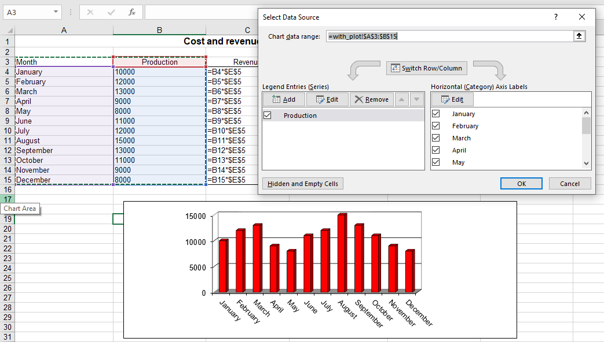{fig-align="center" width="90%"}

## Slide 14 - Exercise Coffee-shop charts

::: {.teaching-file}
[In-class exercise]{.teaching-label .teaching-label-exercise} [`../materials/exercises.xlsx`](../materials/exercises.xlsx){.teaching-button .teaching-button-exercise} -- Sheet: CoffeeShop
:::

**Explain** task by painting expected charts on the blackboard.

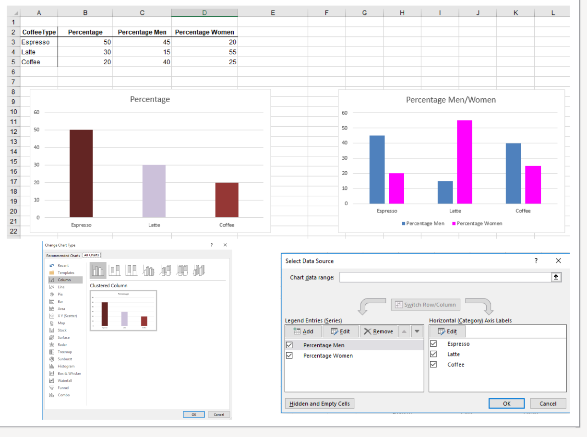{fig-align="center" width="90%"}

::: {.teaching-break}
☕ Break — 10 minutes
:::

## Slide 16 — Formula syntax and functions

- Show graphical Formulas selection (areas: financial, logical, text, ...)
- Demonstrate the function-argument separator.
- Examples (at the bottom of slide 16): how many parameters are there in each function?
- Explicitly distinguish between a **formula** and a **function**.

::: {.callout-important title="Test Excel configuration"}
Test requirement: **For `SUM(3,5)`: everyone should have `8` as the result.**
This ensures that language is set to English and parameters are separated by `,`.

- English: Make sure Excel is in English (File -> Options -> Language; restart)
- Separator:

    1. Close Excel.
    2. Press **`Win` + `R`**.
    3. Enter **`intl.cpl`** and press Enter.
    4. Click **Additional settings… / Weitere Einstellungen…**
    5. Under **Numbers / Zahlen**, set:

    * **Decimal symbol / Dezimaltrennzeichen:** `.`
    * **Digit grouping symbol:** `,`
    * **List separator / Listentrennzeichen:** `,`
    6. Confirm with **OK** and restart Excel.

    In Excel, ensure **File → Options → Advanced → Use system separators** remains enabled.

:::

## Slide 18 - Formula illustration

::: {.teaching-file}
[In-class demo]{.teaching-label .teaching-label-demo} [`../materials/exercises.xlsx`](../materials/exercises.xlsx){.teaching-button .teaching-button-demo} -- Sheet: simple
:::

Add the `=SUM()` at the end, using a **range of cells**.  
Then, add the formula for `Profit (per year)`.

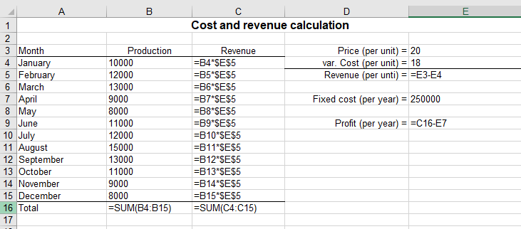{fig-align="center" width="90%"}

Show the **evaluate formula** option (Formulas ribbon):

Example: `=B15+SUM(C4:C23)`.

Then show slide 17.

## Slide 19 - Sales statistics

::: {.teaching-file}
[In-class exercise]{.teaching-label .teaching-label-exercise} [`../materials/exercises.xlsx`](../materials/exercises.xlsx){.teaching-button .teaching-button-exercise} -- Sheet: Sales (conditionals)
:::

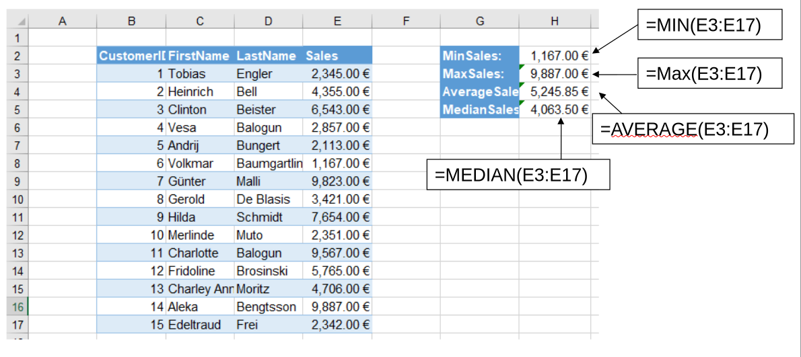{fig-align="center" width="90%"}

## Slide 20 — DAX moving averages (first homework)

::: {.teaching-file}
[Homework]{.teaching-label .teaching-label-homework} [`../materials/exercises.xlsx`](../materials/exercises.xlsx){.teaching-button .teaching-button-homework} -- Sheet: Moving Average
:::

Before or after the break.

- Explain the figure, then the formula, and then ask students how the spreadsheet should look like (draft column-names, maybe where the formulas start, but not the specific formula solutions)
- Focus on the figure and "average of last 10 or 20 days". (focus less on the formula)
- Draft structure on the blackboard
- Last step: create the visualization...

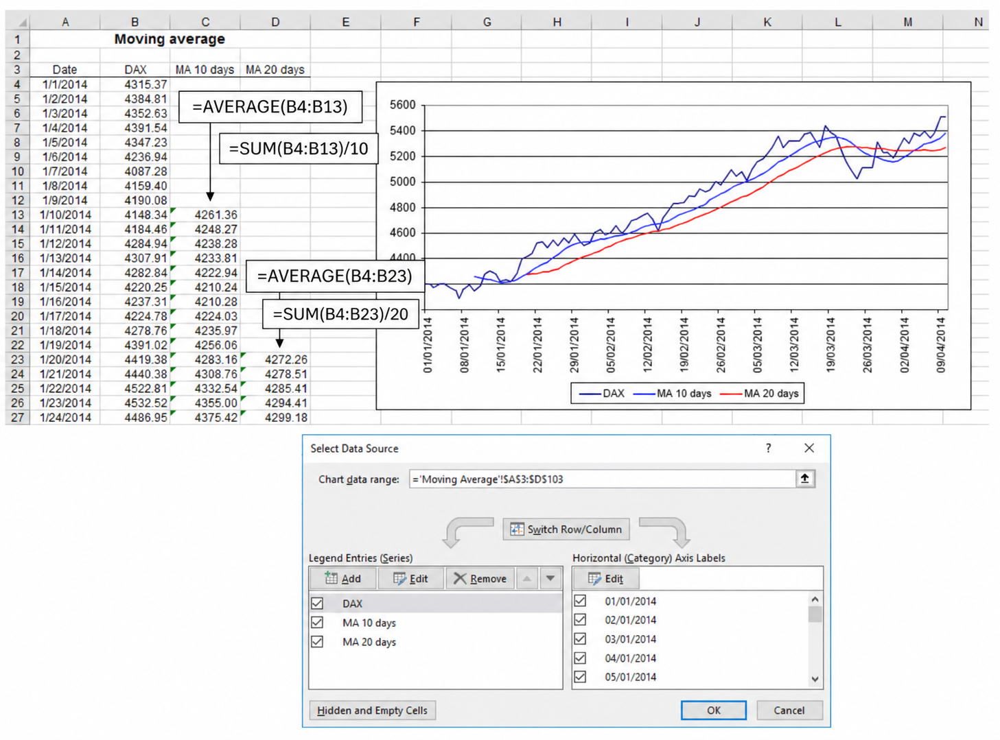{fig-align="center" width="90%"}

## Slide 22 - IF Dialogue

Opens when selecting ribbon Formulas, Logical, IF

::: {.teaching-file}
[In-class demo]{.teaching-label .teaching-label-demo} [`../materials/exercises.xlsx`](../materials/exercises.xlsx){.teaching-button .teaching-button-demo} -- Sheet: conditional_cost
:::

Task: introduce conditional fixed cost and calculate annual profit (based on conditional fixed costs).

Solution:

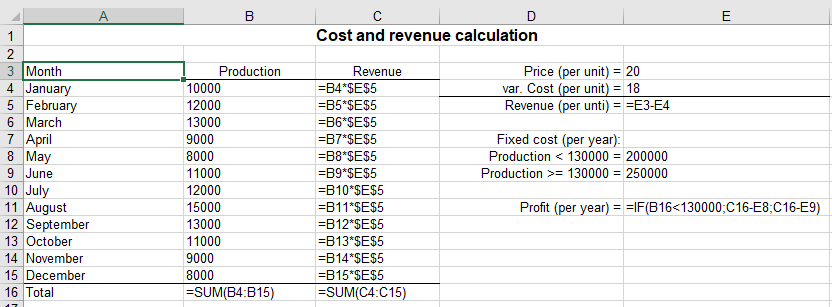{fig-align="center" width="90%"}

## Slides 23–24 — VIP classification and credits

::: {.teaching-file}
[In-class exercise]{.teaching-label .teaching-label-exercise} [`../materials/exercises.xlsx`](../materials/exercises.xlsx){.teaching-button .teaching-button-exercise} -- Sheet: VIP
:::

Prefer nested `IF` functions for the VIP-status exercise (in part II).

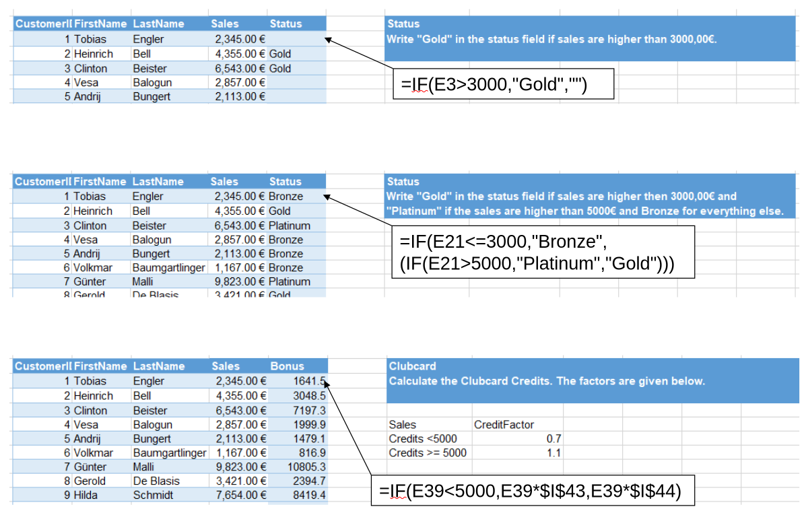

**Solution**: Illustrate the nesting in part 2 on the blackboard:

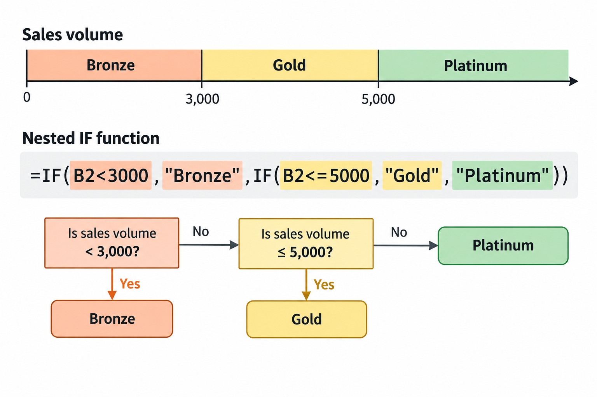{fig-align="center" width="60%"}

## Slide 25/26 — Installment/annuity loans (Homework)

::: {.teaching-file}
[Homework]{.teaching-label .teaching-label-homework} [`../materials/exercises.xlsx`](../materials/exercises.xlsx){.teaching-button .teaching-button-homework} -- Sheets: Installment **and** Annuity
:::

**Allow sufficient explanation because this exercise has caused difficulties in previous cohorts.**

<!--
- Students should have a clear understanding of what the **data cells** (manually entered/modified parameters) and the **function cells** are. (similar to Hillier and Hillier: data/changing/output/objective cells)
- Ask students to understand the `PMT(interest rate, term, loan amount)` function (payment).
-->

**Illustrate logic**

- Use the visualization: [materials/loans.html](../materials/loans.qmd).
- There are some parameters that we can adjust (principal, interest, payment periods) and others that are calculated (repayments).
  It's the same principle in this interface and in your Excel sheet.

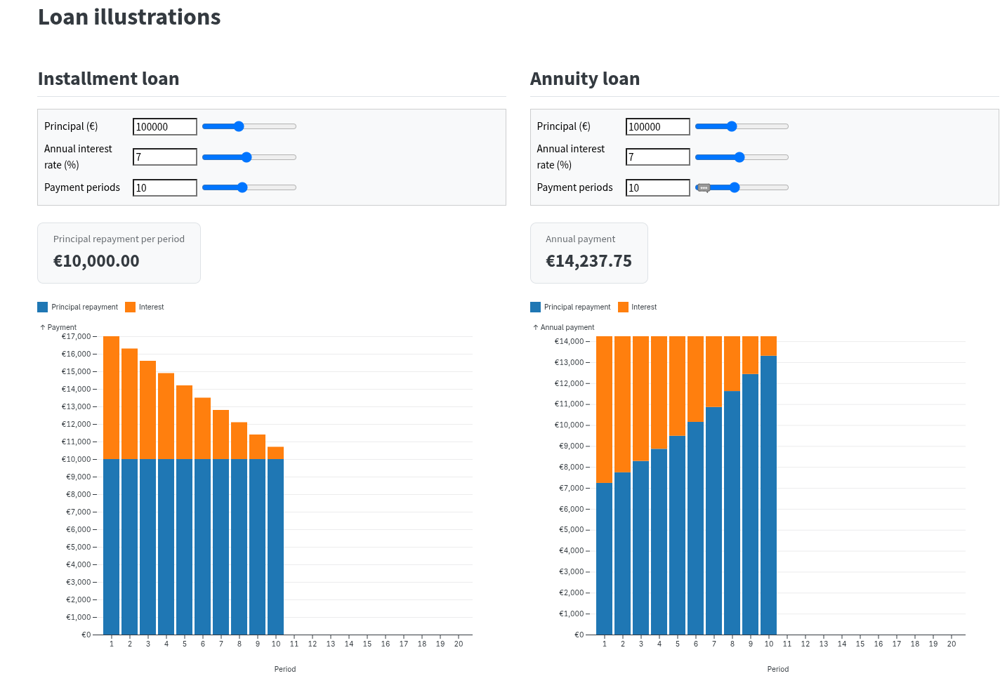{fig-align="center" width="40%"}

::: {.callout-note title="Understanding the difference between fixed installments and annuity loans"}
With a fixed-principal installment loan, the principal is reduced more quickly at the beginning, which lowers the total interest paid. However, this also means that the initial payments are higher.
:::

**Excel sheet: Installment loan**

- Work through the repayment logic in the Excel sheet: **hard-code values instead of adding formulas**.
- Students then transfer the calculation to Excel as a homework.
- Make sure the repayments will not be too much and exceed the remaining principal!
- From period 2 onward, repayment requires an `IF` condition, but students should identify the need for the condition themselves.

**Excel sheet: Annuity loan**

- Annuity: Use the `PMT()` function in the annuity field. Then, start by calculating the interest. The repayment is the remaining amount.

::: {.callout-important}
- The whole table must be filled with formulas. Users will adjust the "number of periods" manually to visualize different scenarios.
- Interest: is always paid on the remainder (whole amount that is still owed) in the **previous period**.
- Insert formulas to make sure that when users modify the `amount`, `interest rate`, or `redemption`, the `payments table` is updated automatically.
- In the **annuity loan** task, the `annuity` should also be updated automatically.
:::

## Slide 27 Exam

::: {.teaching-file}
[In-class exercise]{.teaching-label .teaching-label-exercise} [`../materials/exercises.xlsx`](../materials/exercises.xlsx){.teaching-button .teaching-button-exercise} -- Sheet: Exam
:::

**Show** the task description on p.27 to explain the logic (conditional: more than 10 points in Exercise 5 to pass).

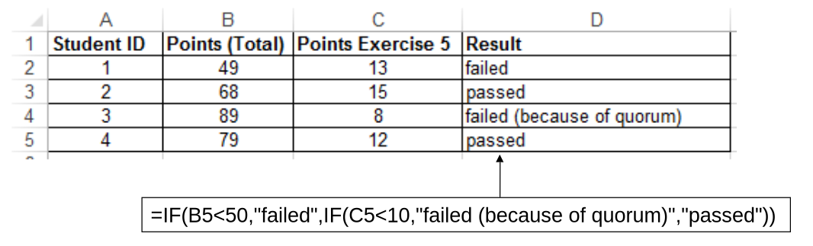{fig-align="center" width="60%"}

### Slide 28: Special IF functions

**Solve together (before revealing slide 28, which contains the solutions).**

::: {.teaching-file}
[In-class exercise]{.teaching-label .teaching-label-exercise} [`../materials/exercises.xlsx`](../materials/exercises.xlsx){.teaching-button .teaching-button-exercise} -- Sheet: Department
:::

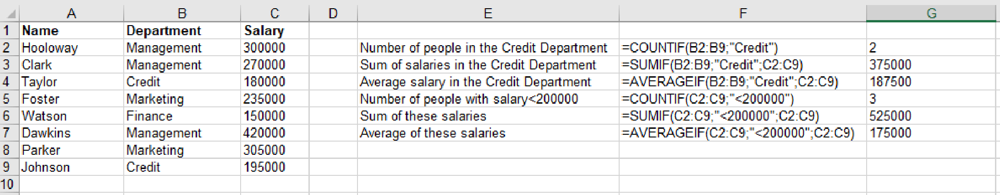

   

### Summary and announcements (next session)

**Prepare the homework for next session (if this is tomorrow: do it today)!**

- DAX moving averages
- Loans: Installment and annuity

::: {.callout-tip title="Notes for improvement"}
Take notes (improvements, common questions) on a separate paper and add to `feedback.qmd` after the session.
:::
