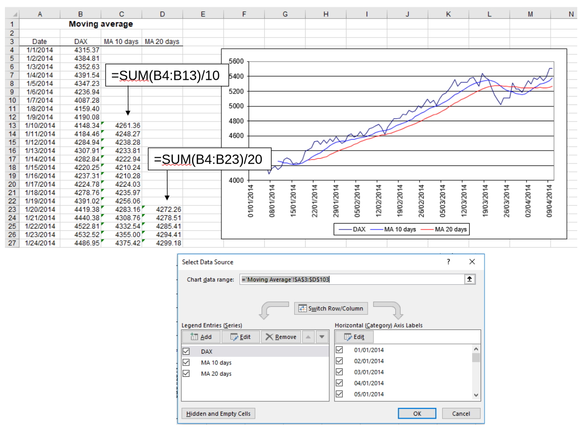

 

| Time                 | Topic/activity                                               | Materials                                                          |
| -------------------: | ------------------------------------------------------------ | ------------------------------------------------------------------ |
| 0–15 min             | Introduction and organization                              | [Introductory slides](../slides/session_00_orga.qmd) (separate)      |
| 15–35 min            | Excel basics, formulas, and cell references                | Slides 1–6                                                        |
| 35–55 min            | Future-value calculation                                   | Slides 7–10 Slides 7 and 10: Exercise **Future value**            |
| 55–70 min            | Data handling and chart selection                          | Slides 11–14 Slide 14: Exercise **Coffee-shop charts**            |
| 70–90 min            | Functions and descriptive statistics                       | Slides 15–19 Slide 19: Exercise **Sales statistics**              |
| **Break**            |                                                            |                                                                      |
| 0–15 min             | Explain the moving-average task and expected output        | Slide 20 Homework **DAX moving averages**                         |
| 15–35 min            | Conditional logic and customer classification              | Slides 21–23 Slide 23: Exercise **VIP status**                    |
| 35–50 min            | Conditional calculations                                   | Slide 24: Exercise **VIP club credits**                              |
| 50–70 min            | Work through the installment-loan calculation on the board | Slide 25: Homework **Installment loan**                              |
| 70–82 min            | Annuity loans and the `PMT` function                       | Slide 26: Exercise **Annuity loan**                                  |
| 82–90 min            | Exam-result classification and wrap-up                     | Slides 27–28 Slide 27: Exercise **Exam result**                   |

: {tbl-colwidths="[10,40,30]"}

## Introductory remarks

Start with a strong focus on programming (I love programming/Github stats, first student assistant job, ..., student coauthors, but also: teaching it in an accessible way; move research interests to the end: theses)

Programming:

- Definition
- Think: what does that involve? what makes a program good?
- Illustrate with StreetComplete:
  - Instructions to handle the map data
  - Instructions to display (layout, like IPhone App experience)
  - Instructions to validate and integrate
  - Testing: automated tests - does the menu still open, is the map still displayed, can users still log in?
  - Testing: user tests (feedback on bugs, improvements, ...)
  - Testing: peer review (readability, understanding code, taking responsibility for code)
- Chatgpt: ask for student votes and a few reactions (arguments)
- Highlight:
  - Testing (ChatGPT makes errors): requires real-world experience (assumptions/requirements, typical interactions, events/exceptions that could be expected)
  - Understanding becomes the new bottleneck (not just generating code) - indeed, large code-bases that are hard to assess in their entirety can be a problem.
  - ChatGPT performs better when we know more about programming and give more precise instructions, recognize problems
  - Responsibility (especially in mission-critical software) becomes more important

### Course structure

- Tutoring sessions start with the **Python** part of the course.

## Successful course

Develop the habit to solve and understand everything. Form learning groups. ASK me again and again

Errors are a normal part of programming and learning
Our tutors do an amazing job and are there for you

- **This is a challenging course.** Previous cohorts have had some failures, so it pays to take it seriously from the beginning.
- A good strategy is to **build a strong foundation early**: study consistently and aim to score close to the full **40 points in the Excel mid-term**.
- Then, when we move on, **put in the effort to really understand Python rather than just getting code to run**.
- Developing this learning rhythm early gives you the best chance to **pass both exams on the first attempt and achieve a strong overall result**.
- **Do not get discouraged by errors.** Errors are a normal part of programming—even for experienced programmers.
- What matters is how you respond: **test, interpret, understand, revise, and try again**.
- **Perseverance builds confidence.** Working through problems yourself is how unfamiliar tasks gradually become manageable.
- **Do not work in isolation.** Explain your solutions, compare approaches, ask others how they solved a problem, and support each other.
- **Ask questions in class.** If something is unclear to you, there is a good chance others have the same question.
- **Use the support available.** The tutors are there to help, and I will do my best to prepare you well throughout the course.
- Of course, I hope you **score very well in the exams**. But the larger goal is that you leave the course **competent and confident enough to tackle programming tasks yourself and to work effectively with IT and programmers in organizations**.

## Slide 1 - Excel basics

In the Excel part, we have two goals:

- Using Excel competently (references, formulas, pivot tables)
- Structuring business problems to solve them effectively (~ programming)

Start Excel and explain the following (without slides):

::: {.teaching-file}
[In-class demo]{.teaching-label .teaching-label-demo} [`../materials/exercises.xlsx`](../materials/exercises.xlsx){.teaching-button .teaching-button-demo} -- Sheet: Start
:::
<!-- see [solution](../materials/exercises_with_solutions.xlsx) -- Sheet: Start -->

{fig-align="center" width="50%"}

- Rows, columns, cells, entering values like numbers, text, boolean values
- Entering formulas in the cell or the bar
- Selecting cells by typing "=A1+A2" vs. by clicking on cells
- Some cells are used for entering data, others for formulas (we need to understand which type of cell is needed)
- Illustrate data types: Add "€" to the numbers and show that the SUM/EXP no longer work.

## Slide 7: Future Value (first exercise)

::: {.teaching-file}
[In-class exercise]{.teaching-label .teaching-label-exercise} [`../materials/exercises.xlsx`](../materials/exercises.xlsx){.teaching-button .teaching-button-exercise} -- Sheet: Future_Value
:::

Task: Create a first spreadsheet and create the formula for future value.

TBD: Illustration:

- 100€ - 5% interest
- 100€ * 0.05 = 5€ earned
- 100€ * 1.05 = 105 € amount after year 1
- 100€ * 1.05 * 1.05 = .... amount after year 2
- ...
- 100€ * 1.05^n

Solution:

{fig-align="center" width="50%"}

<!--
::: {.callout-tip title="Pro tips"}
Use keyboard instead of clicking (prepare/mention shortcuts)
:::
-->

## Slide 8: Referencing cells (example: cost revenue calculation)

**Key insight**: To copy formulas, we need to use appropriate relative, absolute, mixed references.
 
Use `F4` to switch reference type.

- Step 1: start by hard-coding `Revenue per unit`, and copy formula down. Use the `Formulas > Trace precedents` to show that it uses the right values
- Step 2: remove formulas, replace the hard-coded value in the first formula and copy it down. Use the `Formulas > Trace precedents` to show that it does not use the right cell. Illustrate use of an absolte reference (one dimension fixed), update cells, show precedents.

::: {.teaching-file}
[In-class demo]{.teaching-label .teaching-label-demo} [`../materials/exercises.xlsx`](../materials/exercises.xlsx){.teaching-button .teaching-button-demo} -- Sheet: Cost_Revenue
:::

Solution:

{fig-align="center" width="100%"}

## Slide 8: Continued example

- Step 3: extend example: Cost depends two dimensions: assume I am a painter and paint appartments of different sizes with different colors (I will paint your appartment, penthouse etc. with the color you like, base colors are cheap, others more expensive, so it depends on both: size and color). Complex - we need an Excel table to understand what to charge. (small/medium/large  - no square meters, I see it immediately; if you order something with patterns, I will be rich). Illustrate formula copying (sizes will always in column XXX, so make XXX absolute. Prices will always be in row YYY, so make YYY absolute.)
- Check: understanding/questions?
- Optional extension: What if we add a fixed cost for all? Charge everyone an additional 20€ on top? (add an absolute reference)

::: {.teaching-file}
[In-class demo]{.teaching-label .teaching-label-demo} [`../materials/exercises.xlsx`](../materials/exercises.xlsx){.teaching-button .teaching-button-demo} -- Sheet: Cost_Revenue_Painter
:::

Solution:

{fig-align="center" width="100%"}

## Slide 10 - Future Value (second exercise)

::: {.teaching-file}
[In-class exercise]{.teaching-label .teaching-label-exercise} [`../materials/exercises.xlsx`](../materials/exercises.xlsx){.teaching-button .teaching-button-exercise} -- Sheet: Future_Value2
:::

Solution:

{fig-align="center" width="80%"}

::: {.callout-note title="Exam advice"}
Note: Write all formulas below in such a way that they can be copied down/right without modification.
Hard-coding numbers in formulas for which there exist data cells in the sheet is considered a mistake.

Highlight that **copied down/right** is important - illustrate what **without modification** means (e.g., copying down an absolute reference that should be relative/mixed), give examples for **hard-coding values**.
:::

::: {.callout-tip title="Pro tips"}

Expect that Excel spreadsheets will contain errors.
Always check and debug: for the exercises, but also in your job, when you build an Excel spreadsheet or when you get one from a colleague.

- Show formula mode (`ctrl`+`shift`+`` ` ``)
- Show predecessor/successor visually
- Show calculations (stopped?)
:::

## Slide 13 - Charts illustration

::: {.teaching-file}
[In-class demo]{.teaching-label .teaching-label-demo} [`../materials/exercises.xlsx`](../materials/exercises.xlsx){.teaching-button .teaching-button-demo} -- Sheet: with_plot
:::

{fig-align="center" width="90%"}

## Slide 14 - Exercise Coffee-shop charts

::: {.teaching-file}
[In-class exercise]{.teaching-label .teaching-label-exercise} [`../materials/exercises.xlsx`](../materials/exercises.xlsx){.teaching-button .teaching-button-exercise} -- Sheet: CoffeeShop
:::

{fig-align="center" width="90%"}

::: {.teaching-break}
☕ Break — 10 minutes
:::

## Slide 16 — Formula syntax and functions

- Show graphical Formulas selection (areas: financial, logical, text, ...)
- Demonstrate the function-argument separator.
- Examples (at the bottom of slide 16): how many parameters are there in each function?
- Explicitly distinguish between a **formula** and a **function**.

::: {.callout-important title="Test Excel configuration"}
Test requirement: **For `SUM(3,5)`: everyone should have `8` as the result.**
This ensures that language is set to English and parameters are separated by `,`.

- English: Make sure Excel is in English (File -> Options -> Language; restart)
- Separator:

    1. Close Excel.
    2. Press **`Win` + `R`**.
    3. Enter **`intl.cpl`** and press Enter.
    4. Click **Additional settings… / Weitere Einstellungen…**
    5. Under **Numbers / Zahlen**, set:

    * **Decimal symbol / Dezimaltrennzeichen:** `.`
    * **Digit grouping symbol:** `,`
    * **List separator / Listentrennzeichen:** `,`
    6. Confirm with **OK** and restart Excel.

    In Excel, ensure **File → Options → Advanced → Use system separators** remains enabled.

:::

## Slide 18 - Formula illustration

::: {.teaching-file}
[In-class demo]{.teaching-label .teaching-label-demo} [`../materials/exercises.xlsx`](../materials/exercises.xlsx){.teaching-button .teaching-button-demo} -- Sheet: simple
:::

Add the `=SUM()` at the end, using a range of cells:

{fig-align="center" width="90%"}

## Slide 19 - Sales statistics

::: {.teaching-file}
[In-class exercise]{.teaching-label .teaching-label-exercise} [`../materials/exercises.xlsx`](../materials/exercises.xlsx){.teaching-button .teaching-button-exercise} -- Sheet: Sales (conditionals)
:::

{fig-align="center" width="90%"}

## Slide 20 — DAX moving averages (first homework)

::: {.teaching-file}
[Homework]{.teaching-label .teaching-label-homework} [`../materials/exercises.xlsx`](../materials/exercises.xlsx){.teaching-button .teaching-button-homework} -- Sheet: Moving Average
:::

Before or after the break.

- Explain the figure, then the formula, and then ask students how the spreadsheet should look like (draft column-names, maybe where the formulas start, but not the specific formula solutions)
- Focus on the figure and "average of last 10 or 20 days". (focus less on the formula)
- Draft structure on the blackboard
- Last step: create the visualization...

{fig-align="center" width="90%"}

## Slide 22 - IF Dialogue

Opens when selecting ribbon Formulas, Logical, IF

::: {.teaching-file}
[In-class demo]{.teaching-label .teaching-label-demo} [`../materials/exercises.xlsx`](../materials/exercises.xlsx){.teaching-button .teaching-button-demo} -- Sheet: conditional_cost
:::

Task: introduce conditional fixed cost and calculate annual profit (based on conditional fixed costs).

Solution:

{fig-align="center" width="90%"}

## Slides 23–24 — VIP classification and credits

::: {.teaching-file}
[In-class exercise]{.teaching-label .teaching-label-exercise} [`../materials/exercises.xlsx`](../materials/exercises.xlsx){.teaching-button .teaching-button-exercise} -- Sheet: VIP
:::

Prefer nested `IF` functions for the VIP-status exercise (in part II).

## Slide 25/26 — Installment/annuity loans (Homework)

::: {.teaching-file}
[Homework]{.teaching-label .teaching-label-homework} [`../materials/exercises.xlsx`](../materials/exercises.xlsx){.teaching-button .teaching-button-homework} -- Sheet: Installment | Annuity
:::

- Illustrate the repayment logic using the visualization: [materials/loans.html](../materials/loans.qmd).
  We could imagine that a loan adviser uses a similar interface to discuss this with her clients.
  We also note that there are some parameters that we can adjust (principal, interest, payment periods) and others that are calculated (repayments).
  It's the same principle in this interface and in your Excel sheet.

{fig-align="center" width="40%"}

- Work through the repayment logic on the board.
- Students then transfer the calculation to Excel as a homework.
- From period 2 onward, repayment requires an `IF` condition.
- Students should identify the need for the condition themselves.
- Allow sufficient explanation because this exercise has caused difficulties in previous cohorts.

::: {.callout-important}
The repayment equals the fixed repayment amount or, when the remaining debt is lower, the remaining debt.
:::

- Insert formulas to make sure that when users modify the `amount`, `interest rate`, or `redemption`, the `payments table` is updated automatically.
- In the **annuity loan** task, the `annuity` should also be updated automatically.
- Students should have a clear understanding of what the **data cells** (manually entered/modified parameters) and the **function cells** are. (similar to Hillier and Hillier: data/changing/output/objective cells)
- Ask students to understand the `PMT(interest rate, term, loan amount)` function (payment).

::: {.callout-note title="Understanding the difference between fixed installments and annuity loans"}
With a fixed-principal installment loan, the principal is reduced more quickly at the beginning, which lowers the total interest paid. However, this also means that the initial payments are higher.
:::

## Slide 27 Exam

::: {.teaching-file}
[In-class exercise]{.teaching-label .teaching-label-exercise} [`../materials/exercises.xlsx`](../materials/exercises.xlsx){.teaching-button .teaching-button-exercise} -- Sheet: Exam
:::

{fig-align="center" width="60%"}

## Slide 28: Special IF functions

**Solve together (before revealing slide 28, which contains the solutions).**

::: {.teaching-file}
[In-class exercise]{.teaching-label .teaching-label-exercise} [`../materials/exercises.xlsx`](../materials/exercises.xlsx){.teaching-button .teaching-button-exercise} -- Sheet: Department
:::

   

### Summary and announcements (next session)

**Prepare the homework for next session (if this is tomorrow: do it today)!**

::: {.callout-tip title="Notes for improvement"}
Take notes (improvements, common questions) on a separate paper and add to `feedback.qmd` after the session.
:::
