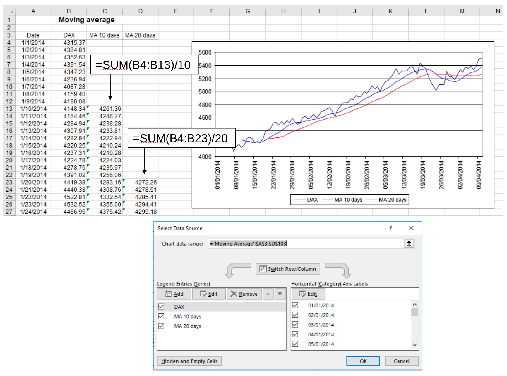
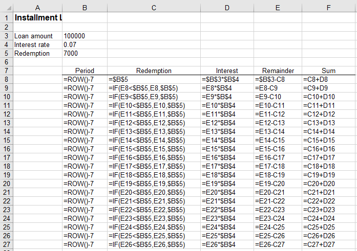
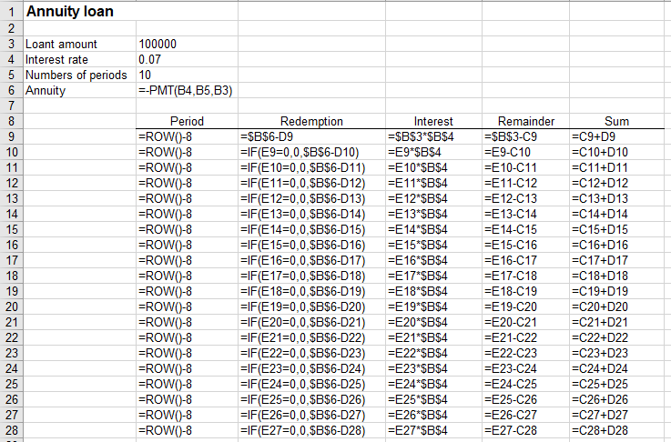
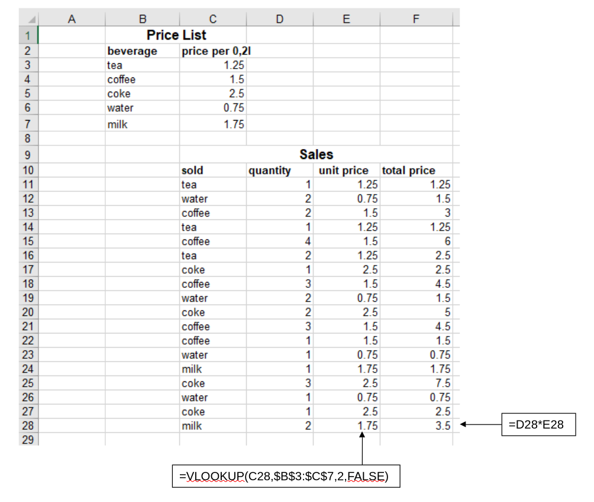
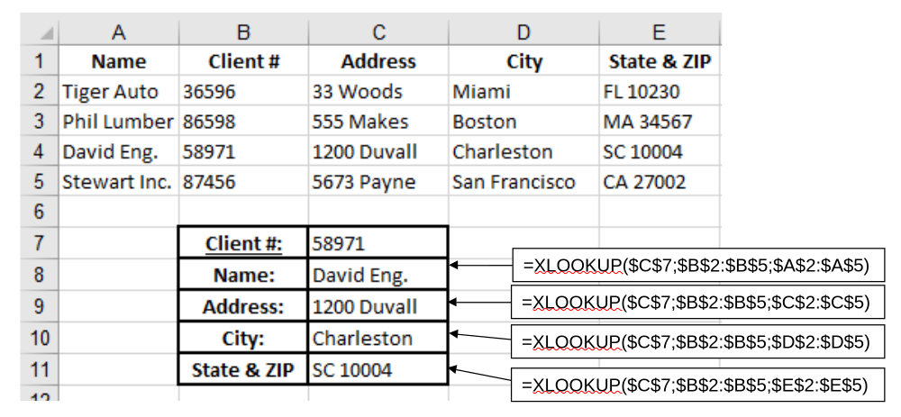

::: {.callout-important title="TODO"}
- Done: Add solution screenshots from `Solutions.pptx`.
- Check solutions in data tables folder (/home/gerit/workspace/action-office/prep-prog/nextcloud/Solutions_Excel/data_tables)
- Confirm the exercise files for **Bar sales**, **Christmas gift**, and **Course grading**.
- TBD: reflection/questions for the next session (maybe as a digital or offline paper submission option?)
- Check/test the vlookup limitation demo (xlookup)

PR:

- Importance of HLOOKUP/approximate matching? - update materials accordingly
:::

Note: PR: Session 2 typically ends at 46. GW: try to cover everything until p.52

| Time                 | Topic/activity                                               | Materials                                                                |
| -------------------: | ------------------------------------------------------------ | ------------------------------------------------------------------------ |
| 0–15 min             | Review take-home exercises <br> (if necessary: complete special IF functions) | Session 1 solutions                                                     |
| 15–55 min            | Introduce `VLOOKUP` and `HLOOKUP`                            | Slides 29–31 <br>Slide 32: Exercise **Bar sales**                        |
| 55–85 min            | Explain `XLOOKUP` and contrast it with `VLOOKUP`             | Slide 33 <br>Slide 34: Exercise **Client lookup**; `Clients.xlsx`                                                               |
| 85–90 min            | Introduce the lookup homework                                | Slides 35–36: **Christmas gift** and **Course grading**                 |
| **Break**            |                                                              |                                                                          |
| 0–15 min             | Introduce and create Excel Tables                            | Slides 37–39; `Bikesales.xlsx`                                         |
| 15–30 min            | Sorting, filtering, table design, and styles                 | Slides 40–42                                                           |
| 30–50 min            | Demonstrate dynamic tables, charts, and row operations       | Slides 43–44                                                           |
| 50–65 min            | Add a Total Row and explain `SUBTOTAL`                       | Slides 45–46                                                           |
| 65–75 min            | Introduce structured references                              | Slides 47–50                                                           |
| 75–90 min            | Begin the Excel Tables exercise                              | Slides 51–52: Exercise **Excel tables**; `Sales_Table.xlsx`            |


## Homework review: DAX moving averages

::: {.teaching-file}
[Homework solution]{.teaching-label .teaching-label-homework} [`../materials/Excel_in_class_exercises.xlsx`](../materials/Excel_in_class_exercises.xlsx){.teaching-button .teaching-button-homework} -- Sheet: Moving Average
:::

Start by briefly explaining the task (again):

- Discuss the spreadsheet structure before discussing individual formulas.
- Check the starting periods for the 10-period and 20-period averages.
- Emphasize that a longer moving average is smoother and reacts more slowly.

{fig-align="center" width="90%"}

## Homework review: Installment loan

::: {.teaching-file}
[Homework solution]{.teaching-label .teaching-label-homework} [`../materials/Excel_in_class_exercises.xlsx`](../materials/Excel_in_class_exercises.xlsx){.teaching-button .teaching-button-homework} -- Sheet: Installment
:::

Explain the payment schema introduced inthe previous session.

Q: Why should the fixed repayment amount not be copied through all 20 periods?  
A: The final repayment must not exceed the remaining debt.

Show how changes in `Loan amount`, `Interest rate` and `Redemption` are automatically reflected in the payments.
This could be used in a What-if or scenario analysis.

{fig-align="center" width="90%"}



::: {.teaching-file}
[Homework solution]{.teaching-label .teaching-label-homework} [`../materials/Excel_in_class_exercises.xlsx`](../materials/Excel_in_class_exercises.xlsx){.teaching-button .teaching-button-homework} -- Sheet: Annuity
:::

- Explain the `PMT(interest rate, term, loan amount)` function (payment).
- Show that the annuity and payments per period change when modifying the numbers of periods.

{fig-align="center" width="90%"}

Add charts for the payments of instalment loans and annuity loans.  
Briefly contrast the declining payments of a fixed-principal loan with the constant payments of an annuity loan.


::: {.callout-important title="Slides"}
If **Special IF functions** were not covered in the previous session: complete slide 28.
:::

## Slides 30–31 — `VLOOKUP` and `HLOOKUP`

Start with the practical example:

::: {.teaching-file}
[In-class demo]{.teaching-label .teaching-label-demo} [`../materials/Excel_in_class_exercises.xlsx`](../materials/Excel_in_class_exercises.xlsx){.teaching-button .teaching-button-exercise} -- Sheet: Bar_Sales
:::

- Scroll down (hide the price list initially)
- Start with a simple approach: filling in raw data. Highlight that this is not how a restaurant works.
  It does not make sense that every sale can have a different price for the same product (the unit price should not be in the sales table).
- Common problem: some data (such as unit prices) should not be entered in the sales table, but they should be taken from the menu.
- Scroll up to the price list and explain.
- Instead of copying data from the price list, we would like to use a formula: VLOOKUP

Whiteboard:

```text
=VLOOKUP(lookup_value, table_array, column_index_num, range_lookup)
```

- Explain parameters (range_lookup: FALSE for exact match; for TRUE/approximate matches, the first column must be sorted in ascending order)
- Write VLOOKUP formula 
- Ask about the need for absolute and relative references
- Calculate total price
- Copy formulas down

{fig-align="center" width="60%"}



Continue on the slides (the general VLOOKUP formula).

Explain the lookup process step by step:

1. Search for the lookup value in the first column of the selected range.
2. Identify the corresponding row.
3. Return the value from the specified column of that row.

Key points:

- The lookup column must be the **leftmost column** in the selected range.
- The return column is identified by a number rather than by its name.
- Use `FALSE` for an exact match.
- Approximate matching with `TRUE` should only be used deliberately and normally requires sorted lookup data.
- Lock the lookup range before copying a formula down.

`HLOOKUP` follows the same principle but searches in the first row instead of the first column. Mention it briefly; focus the practical work on vertical lookups.

## Slide 33 — `XLOOKUP`

General form:

```text
=XLOOKUP(lookup_value, lookup_array, return_array)
```

Contrast it with `VLOOKUP`:

| `VLOOKUP`                                               | `XLOOKUP`                                        |
| ------------------------------------------------------- | ------------------------------------------------ |
| Searches only in the first column of the selected range | Lookup and return arrays are selected separately |
| Cannot directly return a value to the left              | Can return values from either side               |
| Uses a numerical column index                           | Uses an explicit return range                    |
| Approximate match is the default                        | Exact match is the default                       |
| May break when columns are inserted or reordered        | More robust to structural changes                |


::: {.callout-important title="Limitation of VLOOKUP"}
TODO: table is probably the Bar sales. - switch the price list (add an ID as the first column for plausiblity)

Rearrange the columns in the lookup table (**TODO: CLARIFY WHICH ONE**) and show that the formula may fail or return the wrong column. This motivates the introduction of `XLOOKUP`.

Demonstration:

- First solve a lookup with `VLOOKUP`.
- Move the return column to the left of the lookup column.
- Show why `VLOOKUP` no longer works.
- Replace it with `XLOOKUP`.

Example:

```text
=XLOOKUP(D11,$B$3:$B$7,$C$3:$C$7)
```
:::

## Slide 34 — Client lookup

::: {.teaching-file}
[In-class exercise]{.teaching-label .teaching-label-exercise} [`../materials/Clients.xlsx`](../materials/Clients.xlsx){.teaching-button .teaching-button-exercise}
:::

We want to change the client number (type in different values) and then the following fields should update automatically (based on the list above):

- Name
- Address
- City
- State and ZIP code

Teaching sequence:

- Identify the client-number column as the lookup array.
- Create one `XLOOKUP` formula for each requested field.
- Show that the name can be returned even though it is located to the left of the client number.
- Change the client number to test all formulas.

{fig-align="center" width="90%"}

## Slide 35 — Christmas gift (take-home exercise)

::: {.teaching-file}
[Take-home exercise]{.teaching-label .teaching-label-homework} [`../materials/Excel_in_class_exercises.xlsx`](../materials/Excel_in_class_exercises.xlsx){.teaching-button .teaching-button-homework} -- Sheet: Gift
:::

Students should retrieve two values based on customer status:

- Christmas gift
- Packaging

**Formulas are needed for the ChristmasGift and Packaging columns (each retrieving the data from a different table).**

Encourage students to build both a `VLOOKUP`and  `XLOOKUP` solution.

## Slide 36 — Course grading (take-home exercise)

::: {.teaching-file}
[Take-home exercise]{.teaching-label .teaching-label-homework} [`../materials/Excel_in_class_exercises.xlsx`](../materials/Excel_in_class_exercises.xlsx){.teaching-button .teaching-button-homework} -- Sheet: Grading
:::

This one is similar to the client lookup.
We want to enter different StudentIDs and then the lookup functions should retrieve the different test scores and do the calculations of final grades.

::: {.teaching-break}
☕ Break — 10 minutes
:::

**Note: The calculation of the homework contribution is not yet updated in `Excel_Exercises_in_class_session_1_solutions.xlsx` (to use the AVERAGE()/15 x 10). A more recent version of Excel is needed for that.**

## Slides 38–39 — Introduction to Excel Tables

::: {.teaching-file}
[In-class demo]{.teaching-label .teaching-label-demo} [`../materials/Bikesales.xlsx`](../materials/Bikesales.xlsx){.teaching-button .teaching-button-demo}
:::

Create the table together with the students.

Teaching sequence:

- Start with the ordinary range in `Bikesales.xlsx`.
- Select the complete data range.
- Insert an Excel Table.
- Confirm that the range contains headers.
- Rename the table from its default name to `Bikesales`.

Explain the main differences between an ordinary range and an Excel Table:

- Named object
- Automatic headers
- Dynamic expansion
- Integrated filtering and sorting
- Structured references
- Automatically propagated formulas

::: {.callout-important}
A table name identifies the table independently of its position in the worksheet.
:::

::: {.callout-note title="Screenshot placeholder"}
Add a screenshot showing the original range and the converted `Bikesales` table.
:::

## Slide 40 — Sorting and filtering

Demonstrate:

- Sorting by bike name.
- Sorting numerical columns.
- Filtering the table to selected bike models.
- Removing the filter and restoring all rows.

Emphasize that filtering hides records but does not delete them. This distinction becomes important for `SUBTOTAL`.

## Slides 41–42 — Table design and styles

With a cell inside the table selected, open **Table Design**.

Demonstrate:

- Renaming the table.
- Header Row.
- Total Row.
- Banded Rows and Banded Columns.
- First Column and Last Column.
- Filter Button.
- Selecting a predefined table style.

Avoid spending too much time on visual formatting. The main purpose is to show that the table is a managed Excel object.

## Slide 43 — Dynamic data entry and charts

Demonstrate that:

- A new row entered immediately below the table becomes part of the table.
- Table formatting is applied automatically.
- Formulas in calculated columns are copied automatically.
- A chart based on the table expands when new data are added.

Add the `Gravel-Star` row and observe whether the chart changes.

::: {.callout-note title="Screenshot placeholder"}
Add a screenshot showing the dynamically expanded table and chart.
:::

## Slide 44 — Inserting and deleting rows and columns

Distinguish between:

- Inserting a worksheet row.
- Inserting a table row.
- Deleting worksheet cells.
- Deleting a complete table row or column.

Students should understand that table operations affect the table structure, whereas worksheet operations may shift unrelated cells.

## Slide 45 — Calculating totals

Activate **Table Design → Total Row**.

Demonstrate how the drop-down menu can be used to calculate:

- Sum
- Average
- Count
- Maximum
- Minimum

Show the generated formula:

```text
=SUBTOTAL(109,[Cost])
```

Key observation:

- Excel does not use a normal `SUM` formula.
- It generates a `SUBTOTAL` formula that responds to filtering.

::: {.callout-note title="Screenshot placeholder"}
Add a screenshot showing the Total Row and its function-selection menu.
:::

## Slide 46 — `SUBTOTAL` function numbers

TODO: check and understand SUBTOTALS!

Note: need to insert the **Function numbers**! (a mapping table will be provided in the exam)

General form:

```text
=SUBTOTAL(function_num,reference)
```

The first argument encodes the aggregation function:

| Function  | Includes manually hidden rows | Excludes manually hidden rows |
| --------- | ----------------------------: | ----------------------------: |
| `AVERAGE` |                             1 |                           101 |
| `COUNT`   |                             2 |                           102 |
| `COUNTA`  |                             3 |                           103 |
| `MAX`     |                             4 |                           104 |
| `MIN`     |                             5 |                           105 |
| `PRODUCT` |                             6 |                           106 |
| `STDEV`   |                             7 |                           107 |
| `STDEVP`  |                             8 |                           108 |
| `SUM`     |                             9 |                           109 |
| `VAR`     |                            10 |                           110 |
| `VARP`    |                            11 |                           111 |

::: {.callout-important title="Exam-relevant distinction"}
Filtered-out rows are excluded by `SUBTOTAL`.

For manually hidden rows:

- Function numbers 1–11 include them.
- Function numbers 101–111 exclude them.
:::


Demonstrate the difference by:

1. Calculating a total.
2. Filtering the table.
3. Observing the recalculated total.
4. Manually hiding a row.
5. Comparing function numbers `9` and `109`.

## Slides 47–50 — Structured references

Use this section if time permits; otherwise, continue at the beginning of Session 3.

Note: structured references work regardless of where the table is located (name references).

## Basic structured references

Contrast:

```text
=SUM(E3:E7)
```

with:

```text
=SUM(Bikesales[Cost])
```

Explain that the structured reference:

- Uses table and column names.
- Is easier to interpret.
- Expands automatically.
- Is independent of the table's location on the worksheet.

## Components

A structured reference can contain:

- Table name
- Item specifier
- Column specifier

Examples:

```text
Bikesales[Cost]
Bikesales[[#Totals],[Turnover]]
Bikesales[[#Totals],[Turnover]:[Cost]]
```

Item specifiers:

| Specifier    | Meaning      |
| ------------ | ------------ |
| `[#All]`     | Entire table |
| `[#Data]`    | Data rows    |
| `[#Headers]` | Header row   |
| `[#Totals]`  | Total row    |

## Current-row references

Inside the table, `@` refers to the current row:

```text
=[@Turnover]-[@Cost]
=[@Cost]/[@Sales]
=[@Turnover]*1.19
```

After entering the formula once, Excel should copy it to the complete calculated column.

::: {.callout-note title="Screenshot placeholder"}
Add a screenshot illustrating an outside-table reference and an `@` current-row reference.
:::

## Slides 51–52 — Excel Tables exercise

::: {.teaching-file}
[In-class exercise]{.teaching-label .teaching-label-exercise} [`../materials/Sales_Table.xlsx`](../materials/Sales_Table.xlsx){.teaching-button .teaching-button-exercise}
:::

This extended exercise can be completed in class, assigned as take-home work, or continued in Session 3.

Suggested checkpoints:

## Table setup

- Convert the data into an Excel Table.
- Name the table `Sales`.
- Sort by region.
- Filter to 2020 and restore all years.
- Delete the records for Brazil.

## Total Row

Calculate:

- Sum of quantity
- Sum of cost
- Average turnover
- Maximum year

## Structured references

Outside the table:

- Count the number of records.
- Recalculate total profit.
- Calculate total turnover using the turnover column.
- Refer directly to values in the Total Row.
- Add the values in the Total Row.

Inside the table, add:

```text
Profit = Turnover - Cost
TOpU = Turnover / Quantity
QShare = Quantity / total quantity
```

Possible formulas:

```text
=[@Turnover]-[@Cost]
=[@Turnover]/[@Quantity]
=[@Quantity]/Sales[[#Totals],[Quantity]]
```

Format `QShare` as a percentage.

## Regional summary

- Extract the unique regions:

```text
=UNIQUE(Sales[Region])
```

- Calculate turnover by region:

```text
=SUMIF(Sales[Region],region_cell,Sales[Turnover])
```

- Create a chart showing turnover by region.

::: {.callout-note title="Screenshot placeholder"}
Add screenshots from `Solutions.pptx` showing:

- The completed `Sales` table
- The calculated columns
- The Total Row
- The regional summary
- The final chart
:::

## Summary and announcements

Possible reflection questions:

- Why can `XLOOKUP` return a value to the left while `VLOOKUP` cannot?
- Why does an Excel Table use `SUBTOTAL` rather than `SUM` in its Total Row?
- What advantage does `Sales[Turnover]` provide compared with a fixed cell range?
- What does `[@Turnover]` mean?


Take-home work:

- **Christmas gift**
- **Course grading**
- Complete the **Sales Table** exercise if it was not finished in class.

Next session:

- Finish structured references and the table exercise, if necessary.
- Introduce PivotTables.

::: {.callout-tip title="Notes for improvement"}
Take notes on timing, common errors, unclear instructions, and suitable stopping points on a separate paper and add them to `feedback.qmd` after the session.
:::
