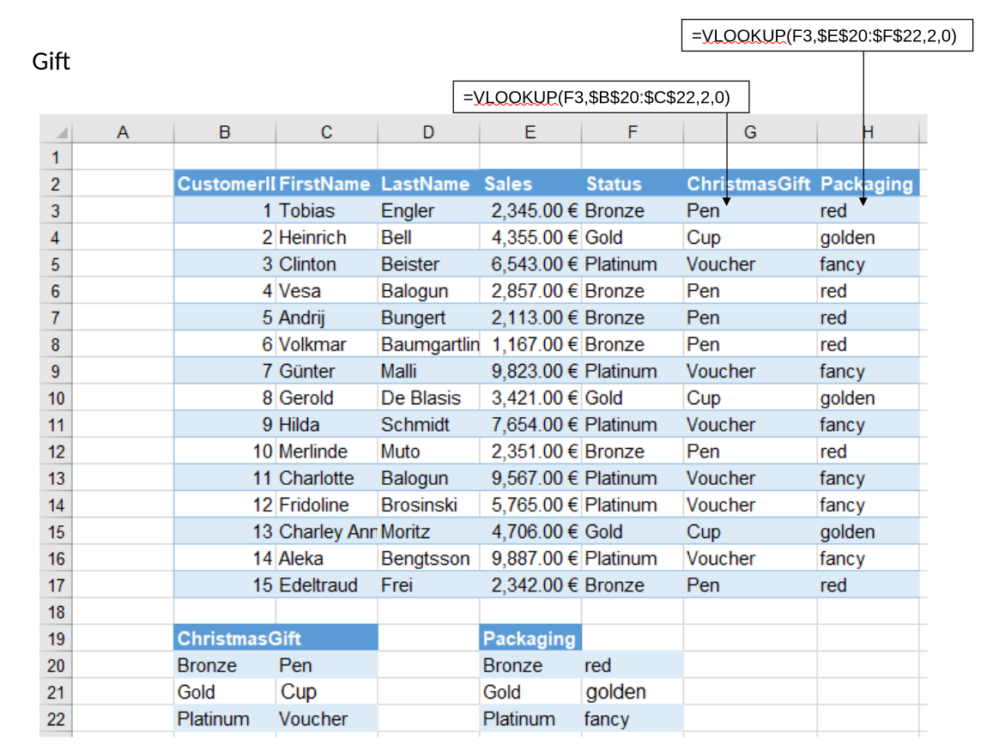
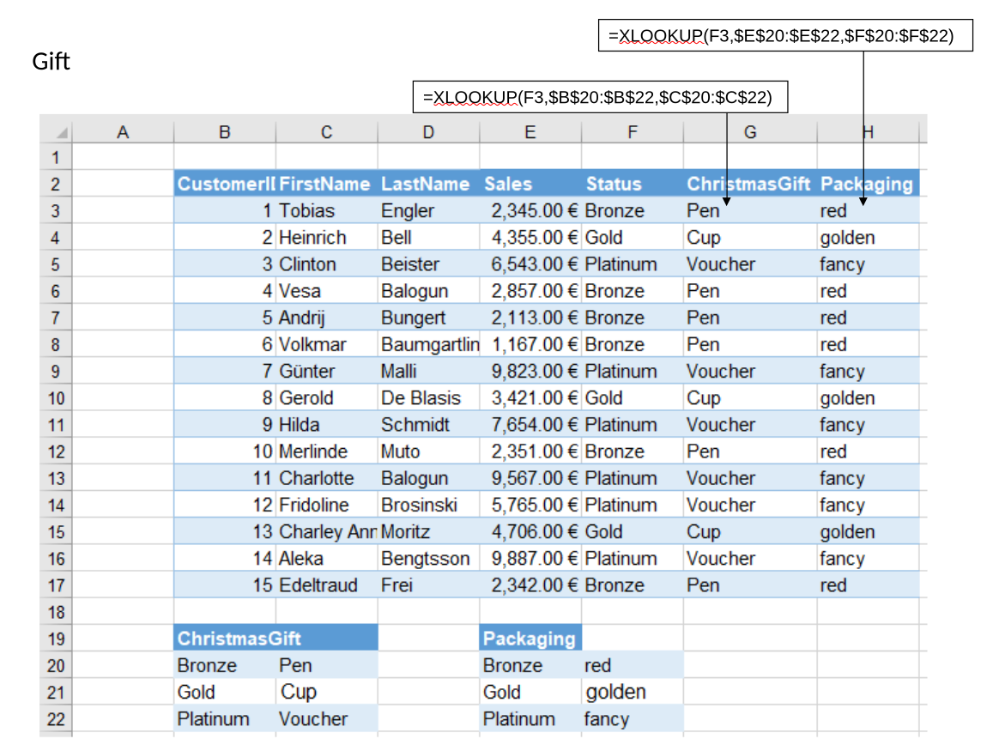
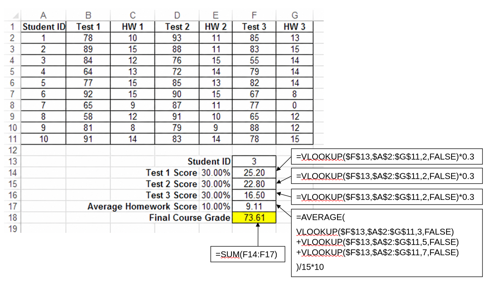
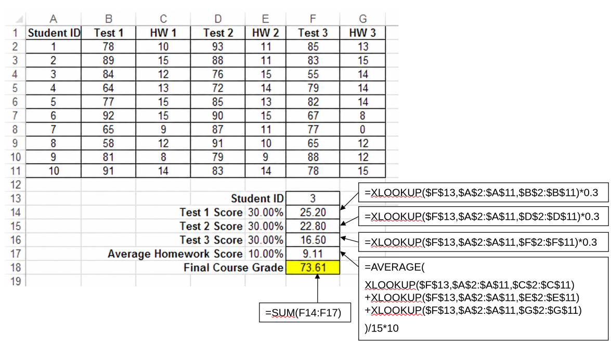

- Include remaining solutions in the `pivot` folder (/home/gerit/workspace/action-office/prep-prog/nextcloud/Solutions_Excel/pivot)

## Exercises

| Slide(s) | Exercise                    | Summary                                                                               | Files           | In-class vs take-home |
| -------: | --------------------------- | ------------------------------------------------------------------------------------- | --------------- | --------------------- |
|       76 | Exporter pivot tables       | Create five PivotTable views analyzing sales by country, category, product, and time. | `Exporter.xlsx` |                       |
|       77 | Expeditioner pivot analysis | Reproduce the specified PivotTable report and answer six detailed sales questions.    | `Exped.xlsx`    |                       |

## Gift (VLOOKUP)

::: {.teaching-file}
[Take-home exercise]{.teaching-label .teaching-label-homework} [`../materials/Excel_in_class_exercises.xlsx`](../materials/Excel_in_class_exercises.xlsx){.teaching-button .teaching-button-homework} -- Sheet: Gift
:::

{fig-align="center" width="90%"}

## Gift (XLOOKUP)

Note: copy the sheet to solve it with XLOOKUP

{fig-align="center" width="90%"}

## Grading (VLOOKUP)

::: {.teaching-file}
[Take-home exercise]{.teaching-label .teaching-label-homework} [`../materials/Excel_in_class_exercises.xlsx`](../materials/Excel_in_class_exercises.xlsx){.teaching-button .teaching-button-homework} -- Sheet: Grading
:::

{fig-align="center" width="90%"}

## Grading (XLOOKUP)

Note: copy the sheet to solve it with XLOOKUP

{fig-align="center" width="90%"}

::: {.callout-tip "In-class exercise: Sales table"}
Complete the in-class exercise **Sales table** if it was not completed in the previous session.
Use [teaching notes for session 2](session_02.qmd).
:::

## Slide 54 - Pivot tables

Pivots: Mit Daten vs. Entscheidung Erklärung starten, dann Beispiel in Excel durchgehen.

PR: legt die Pivot-Folien gar nicht im Detail auf.

::: {.teaching-break}
☕ Break — 10 minutes
:::

## Slide 75

Aggregation über Datum: siehe auch in den Folien

## Slide 76/77

In-session (if enough time)

## Summary and announcements (next session)

TODO

::: {.callout-tip title="Notes for improvement"}
Take notes (improvements, common questions) on a separate paper and add to `feedback.qmd` after the session.
:::
