<br>

::: {.callout-tip title="Preparation"}
- Print solutions for Excel Tables (previous session)
- Upload [Excel cheatsheet](../materials/excel-cheat-sheet.pdf)
- Prep explanation of the cube concept (and how it matches to Excel!)
:::

Last Excel session already!

| Time      | Topic/activity                                                | Materials                                      |
| --------: | ------------------------------------------------------------- | ---------------------------------------------- |
| 0–20 min  | Review homework                                               | Slides 36–37; sheets `Gift` / `Grading`        |
| 20–35 min | Complete the **Sales table** exercise, if necessary           | Slides 51–52; sheet `Sales_table`              |
| 35–50 min | Motivate PivotTables through management questions             | Slides 54–60                                   |
| 65–90 min | Create the first PivotTable and explain the field areas       | Slides 65–66                                   |
| **Break** |                                                               |                                                |
| 0–20 min  | Filtering, aggregations, and displaying values                | Slides 67–69                                   |
| 20–40 min | Multiple dimensions and measures; PivotCharts                 | Slides 70–73                                   |
| 40–55 min | Calculated fields and date grouping                           | Slides 74–75                                   |
| 50–65 min | Explain facts, dimensions, data cubes, and slicing            | Slides 61–64                                   |
| 55–85 min | Complete the **Exporter** exercise                            | Slide 76; `Exporter_data` / `Exporter_pivot`   |
| 85–90 min | Introduce the **Expeditioner** exercise                       | Slide 78; `Exped_data` / `Exped_pivot`         |

: {tbl-colwidths="[20,40,40]"}

::: {.callout-tip title="Excel language settings"}
Students should configure Excel to use **English function names** and **comma separators**:

{fig-align="center" width="18%"}
:::



## Homework review: Christmas gift

::: {.teaching-file}
[Homework solution]{.teaching-label .teaching-label-homework} [`../materials/exercises_with_solutions.xlsx`](../materials/exercises_with_solutions.xlsx){.teaching-button .teaching-button-homework} -- Sheet: Gift
:::

Students should retrieve two values based on customer status:

- Christmas gift
- Packaging

The values come from two different lookup tables.

### `VLOOKUP` solution

Review:

- The lookup value is the customer status.
- The lookup column must be the first column of the selected table.
- The return-column number is 2.
- Use `FALSE` for an exact match.
- Lock the lookup ranges before copying the formulas.

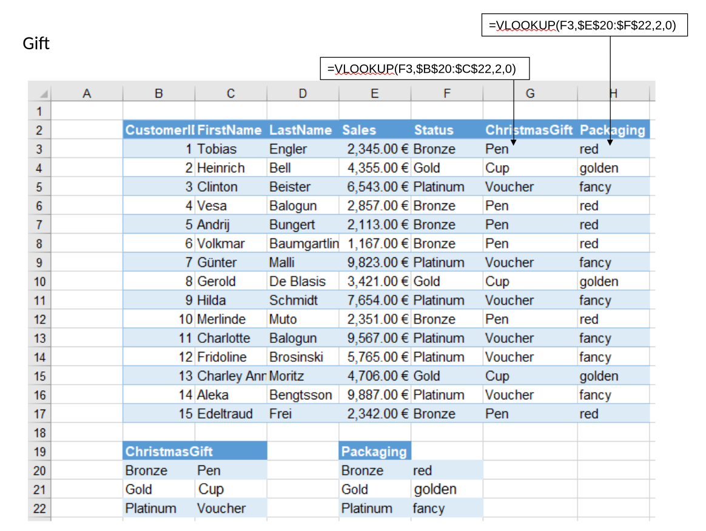{fig-align="center" width="90%"}

### `XLOOKUP` solution

Copy the sheet before creating the `XLOOKUP` solution.

Contrast the formula structure with `VLOOKUP`:

```text
=XLOOKUP(lookup_value,lookup_array,return_array)
```

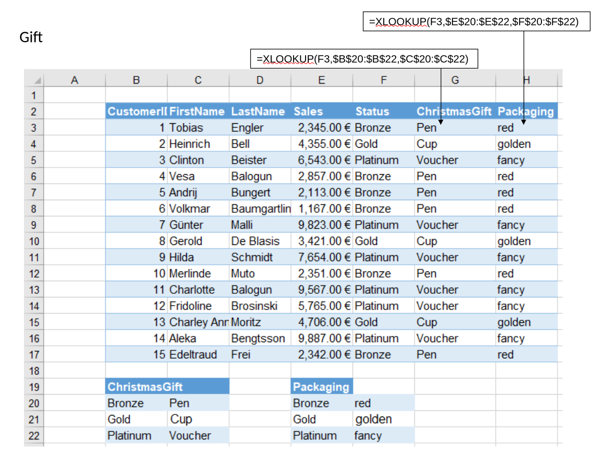{fig-align="center" width="90%"}

## Homework review: Course grading

::: {.teaching-file}
[Homework solution]{.teaching-label .teaching-label-homework} [`../materials/exercises_with_solutions.xlsx`](../materials/exercises_with_solutions.xlsx){.teaching-button .teaching-button-homework} -- Sheet: Grading
:::

### `VLOOKUP` solution

Review the sequence:

1. Retrieve the homework and exam scores.
2. Calculate the contribution of each assessment component.
3. Add the contributions to obtain the final course grade.

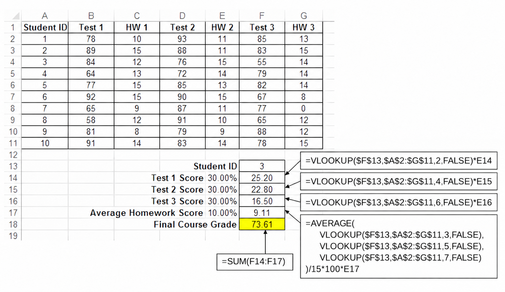{fig-align="center" width="90%"}

::: {.callout-note}
- Lookup functions return one value, this means three lookups are required for the homework part
- In Excel 365, it is possible to select a set of return columns `{3,5,7}`.
:::

**Validation**: Change the `StudentID` and check that the workbook retrieves the corresponding scores and recalculates the final grade.

For the illustrated student, check:

- Homework contribution: `9.11`
- Final course grade: `73.61`

### `XLOOKUP` solution

Copy the sheet and replace the `VLOOKUP` formulas with `XLOOKUP`.

Emphasize that each score column has its own return array, while all formulas use the same StudentID lookup array.

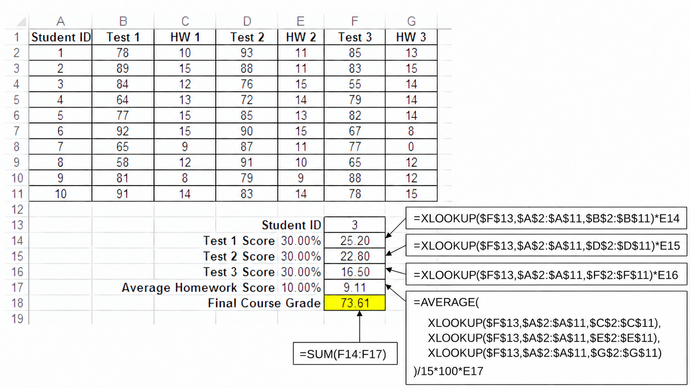{fig-align="center" width="90%"}

::: {.callout-tip title="In-class exercise on Excel Tables: Sales table"}
Complete the in-class exercise on Excel Tables **Sales table** if it was not completed in the previous session.

Use the [teaching notes for Session 2](session_02.html#slides-5152-excel-tables-exercise).
:::

## Slides 54–60 — Pivot tables: From data to management questions

::: {.teaching-file}
[In-class demo]{.teaching-label .teaching-label-demo} [`../materials/exercises.xlsx`](../materials/exercises.xlsx){.teaching-button .teaching-button-demo} -- Sheets: Sales_data | Sales_pivot
:::

Refer to the Excel Table example (from previous session): highlight that manually writing formulas for aggregate and conditional statistics can be tedious (e.g., by product, region, time).
PivotTables help for that.

### Slide 65 — Creating a PivotTable

Before creating the PivotTable, briefly check that:

- Each column has one header.
- Each row represents one observation.
- There are no blank header cells.
- Numerical facts are stored as numbers.
- Dates are stored as actual Excel dates.

Demonstrate the process in Excel: Select source dataset > choose **Insert → PivotTable**

Remember to explicitly refresh the data through the ribbon.

::: {.callout-tip titl="Pro tip"}
Insert an Excel Table first, then Insert a PivotTable (PivotTables could be created without an Excel Table, but the references are much clearer with object names)
:::

### Example: Build the reports from the slides step by step

Key message:

> A PivotTable makes it possible to generate different analytical views from the same underlying records without manually constructing each summary table.

Begin with the decisions and questions that the data should support (instead of the mechanics of PivotTables).

Ask students to modify one field at a time and predict the resulting table before releasing the mouse button.

Show that the same sales data can answer different questions by creating pivot tables for the following:

### What is total turnover in 2020?

- Filter for `year = 2020`
- Values: `Sum of turnover`
- Filter for `category`, use `actual`

Demonstrate two kinds of filters:

- Report filters above the PivotTable
- Filters attached to row or column labels

For demonstration: Filter the product columns to retain only selected products.

Emphasize:

- Filtering changes the displayed slice.
- It does not delete the underlying observations.
- Grand totals are recalculated based on the active filter.

### What is turnover by product group in 2020?

- Drag `product` to rows

### What is turnover in the first three months of 2020?

- Drag `month` to columns
- Filter for first three months

### What is turnover by region in the first three months of 2020?

- Remove `product` from rows
- Drag `region` to rows

### What is the turnover in each region by product group in 2019 and 2020?

- Columns: Remove `month`, add `product`
- Rows: `region`, then `year`
- Filter: `year`, for 2019 and 2020.

### How can we show turnover as a percentage of total?

- Right-click, `Show values as`, **try and interpret different options**
- Undo
- Select the right-click, `Value Field Settings', show option to display averages, ...

Distinguish carefully between:

- The numerical aggregation used to create a value
- The way the resulting value is displayed

For example:

- Aggregation: `Sum`
- Display: `% of Grand Total`

Explain a common error: When Excel interprets a numerical column as text, it may use `Count` instead of `Sum`.

### How do actual and target values compare?

- Drag `category` to columns
- Remove filter for `category`

### How can (sub)totals be modified?

Through `Design` ribbon:

- Subtotals
- Grand totals (e.g., Off for rows and columns).

::: {.callout-tip title="Summary"}
- Creating a PivotTable
- Selecting columns/rows (first/second/third... order)
- Filtering to select values
- Changing Values (Sum, Percentage, ....)
- Values selection: can include different attributes (e.g., cost and turnover) or differnt aggregations of the same attribute (e.g., sum and average of turnover)
:::

::: {.teaching-break}
Break — 10 minutes
:::

### Slide 73 — PivotCharts

Create a PivotChart from the current PivotTable.

Demonstrate that:

- The chart is connected to the PivotTable.
- PivotTable filters also change the chart.
- Fields can be filtered directly through the chart controls.

<!-- **SCREENSHOT:** PivotChart with visible field controls. -->

### Slide 74 — Calculated fields

**PivotTable Analyze → Fields, Items & Sets → Calculated Field**

Create a calculated field:

```text
Name: Profit
Formula: =Turnover-Cost
```

Add the calculated field and use it in the Values area.

Key point:

> Calculated fields refer to source-field names rather than worksheet cells.

<!-- **SCREENSHOT:** Calculated Field dialog with the `Profit` formula. -->

### Slide 75 — Grouping dates

**Important**: Create PivotTable for the `Store_data` sheet, which contains dates!

::: {.teaching-file}
[In-class demo]{.teaching-label .teaching-label-demo} [`../materials/exercises.xlsx`](../materials/exercises.xlsx){.teaching-button .teaching-button-demo} -- Sheets: Store_data | Store_pivot
:::

Explain that PivotTables can aggregate an actual date field automatically.

Demonstrate:

1. Place the date field in **Rows**.
2. Observe auto-grouping (years/quarters/months)
3. Highlight that the original data is more granular
4. Right-click one of the dates.
6. Select **Group**.
7. Unselect `Months`, `Quarters`, and `Years`. Select `Days`.

## Theory : Data warehouse concepts, including data cubes and facts vs dimensions


Typically, there are some attributes that we will use for the `values` and others that will be used for `rows`, `columns` and `filters`.
For `values`, we need data that can be aggregated numerically (e.g., through sum functions), for the others, we prefer categorical data that allows us to group observations.
These we refer to as facts and dimensions.
This corresponds to the multi-dimensional hypercube analyses in Excel (a type of analysis that we will also see in other analytical software packages).

### Slide 61 — Facts and dimensions

Introduce the distinction using the table on the slide.

| Type       | Purpose                                   | Examples                               |
| ---------- | ----------------------------------------- | -------------------------------------- |
| Dimensions | Describe, classify, group, or filter data | Region, product, category, month, year |
| Facts      | Numerical values that can be aggregated   | Turnover, cost, profit, quantity       |

Revisit Slides 56–61. Select two or three examples and ask students:

- Which number is being aggregated?
- Which categories are used to divide the number?
- Which values are fixed or filtered?

### Slides 62–63 — Data cube and slicing

Use the cube as a conceptual model.
Explain:

- Each dimension provides a perspective on the data.
- A fact is stored for combinations of dimension values.
- A PivotTable therefore presents a two-dimensional slice of a multidimensional dataset.
- Filters fix the dimensions that are not currently shown in rows or columns.

## Slide 76 — Exercise: Exporter pivot tables

::: {.teaching-file}
[In-class exercise]{.teaching-label .teaching-label-exercise} [`../materials/exercises.xlsx`](../materials/exercises.xlsx){.teaching-button .teaching-button-exercise} -- Sheets: Exporter_data | Exporter_pivot
:::

Complete this exercise in class only if sufficient time remains. Otherwise, assign it as homework.

**Note**: The tasks often leave it open if we select attributes for the rows or columns. It is specified unambiguously when we display the expected output table (as in the exam).

### Task 1 — Category sales by country

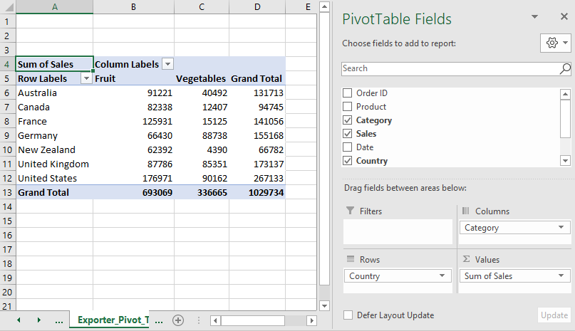{fig-align="center" width="80%"}

### Task 2 — Fruit-product sales by country

- Filter for the fruit category.

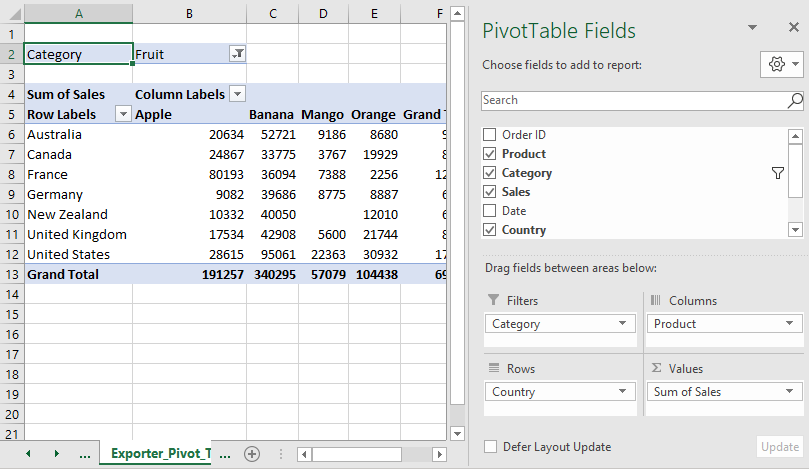{fig-align="center" width="80%"}

### Task 3 — Product sales in Germany

Use column label filter to select `Germany` (or add `country` in Filters and select `Germany` there).

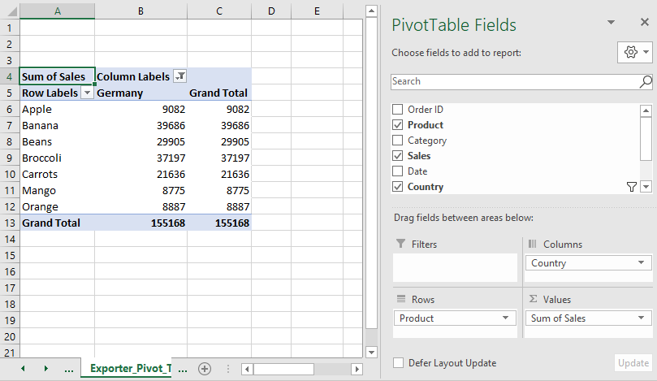{fig-align="center" width="80%"}



### Task 4 — Product sales by quarter and month

Group the date field (**right click on a date cell**) by:

- Quarters
- Months

Then, expand Quarters to show Months.

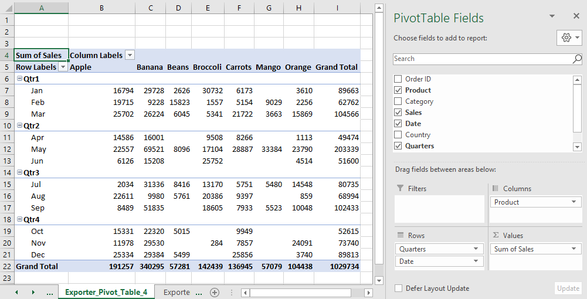{fig-align="center" width="80%"}

### Task 5 — European countries in Q4

- Use `Country` filter to select European countries: `[Germany, France, United Kingdom]`.
- Filter the grouped date field to Q4.

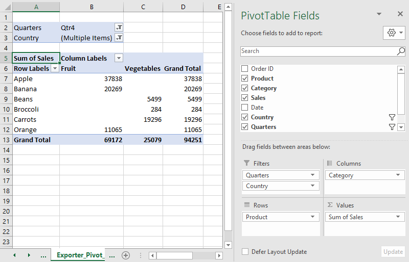{fig-align="center" width="80%"}

<!--
Teaching procedure:

- Allow students to work independently first.
- Compare the field arrangements after each task.
- Emphasize that several arrangements may answer the same question.
- Check the aggregation and active filters before comparing numerical results.

**SCREENSHOT:** Completed Exporter PivotTables.
-->



## Slide 78 — Exercise: Expeditioner pivot analysis

::: {.teaching-file}
[In-class exercise]{.teaching-label .teaching-label-exercise}/[Homework]{.teaching-label .teaching-label-homework} [`../materials/exercises.xlsx`](../materials/exercises.xlsx){.teaching-button .teaching-button-exercise} -- Sheets: Exped_data | Exped_pivot
:::

**Note**: Sales refers to the **REVENUE** column (unless we refer to the number of products).

- Briefly inspect the dataset and available attributes.
- Reproduce the report shown on the slide:

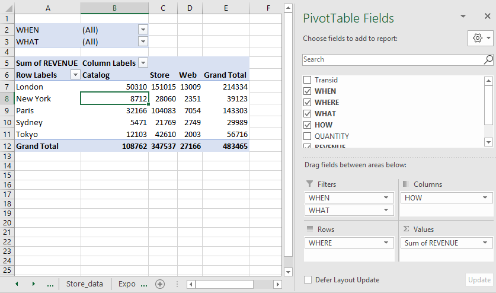{fig-align="center" width="70%"}

### Question 1 — London catalog sales in Q1

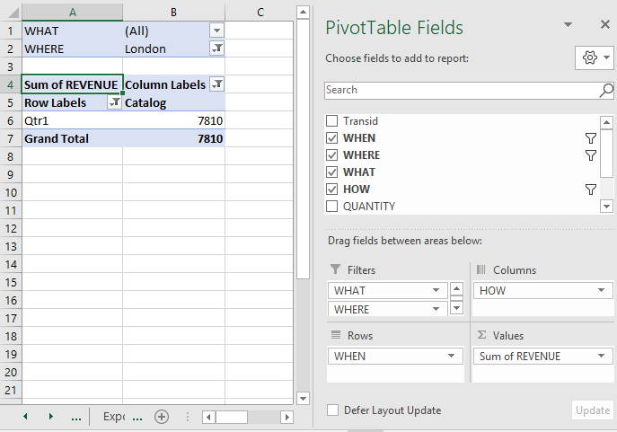{fig-align="center" width="70%"}

- Move `WHEN` from **Filters** to **Rows** so the dates can be grouped and compared.
- Move `WHERE` from **Rows** to **Filters**, then filter it to London.
- Right-click a date (or select a date and choose **Group Selection**), choose **Group**, select **Quarters**, and deselect **Months** if necessary.
- In the `HOW` column field, show Catalog only. Read the Catalog value for Qtr1.

### Question 2 — Tokyo Q4 Web sales as a percentage of annual sales

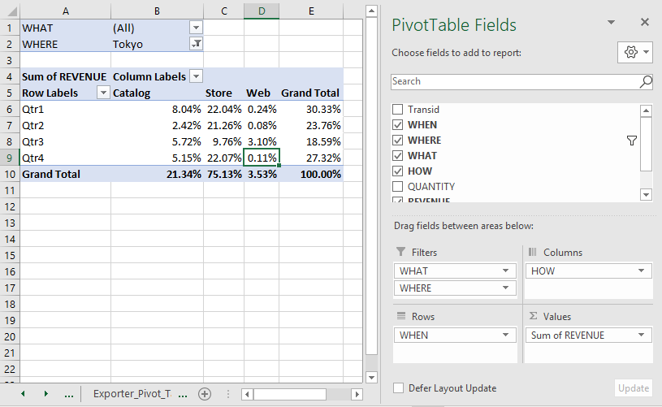{fig-align="center" width="70%"}

- Filter `WHERE` to Tokyo.
- Keep `HOW` in **Columns**, grouped `WHEN` / Quarters in **Rows**, and `REVENUE` in **Values**.
- Open **Value Field Settings**, choose **Show Values As**, and select **% of Grand Total**. This makes every cell a share of Tokyo's annual total across all channels.
- Read the Web value for Qtr4.

### Question 3 — Sydney annual Catalog share

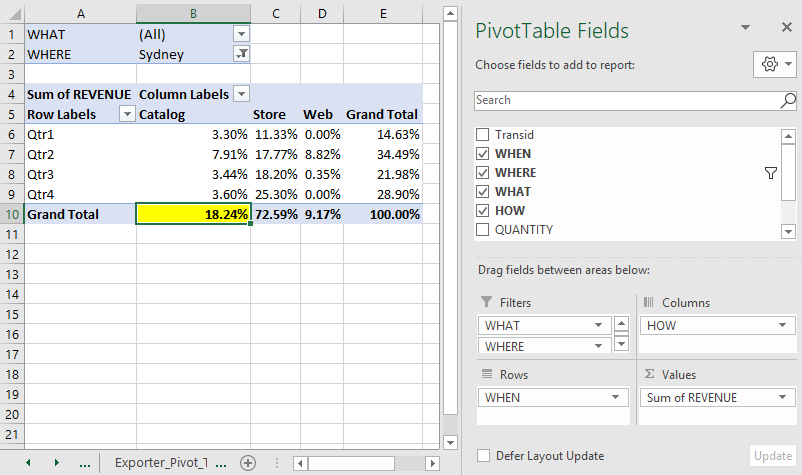{fig-align="center" width="70%"}

- Filter `WHERE` to Sydney.
- Keep `HOW` in **Columns**, grouped `WHEN` / Quarters in **Rows**, and `REVENUE` in **Values**.
- In **Value Field Settings** > **Show Values As**, select **% of Grand Total**.
- Use the **Grand Total** row in the Catalog column; this combines all quarters and therefore gives the annual Catalog share.

### Question 4 — Camel saddle sales for Paris by quarter

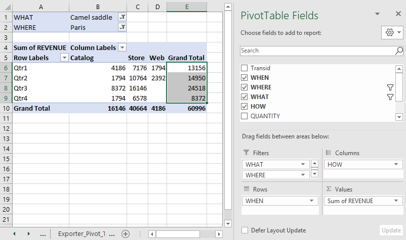{fig-align="center" width="70%"}

- Filter `WHAT` to Camel saddle and `WHERE` to Paris.
- Put grouped `WHEN` / Quarters in **Rows**, keep `HOW` in **Columns**, and keep `REVENUE` in **Values** as **Sum of REVENUE**.
- Read each quarter from the **Grand Total** column, which adds the sales channels for that quarter.

### Question 5 — London January Catalog sales and source transactions

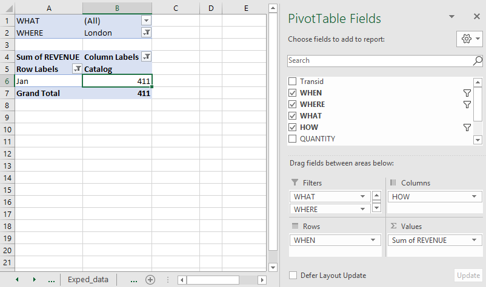{fig-align="center" width="70%"}

- Filter `WHERE` to London and restrict `HOW` to Catalog.
- Change the `WHEN` date grouping from Quarters to **Months**, then read the January value.

::: {.callout-tip title="Inspecting results"}
- To inspect the contributing records, double-click `411` (or use **Show Details**). Excel creates a new worksheet containing the source records behind that PivotTable cell.
- The two records are:

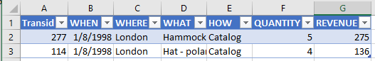{fig-align="center" width="70%"}

- Check that `275 + 136 = 411`.
:::

### Question 6 — Elephant polo stick quantities in New York by month

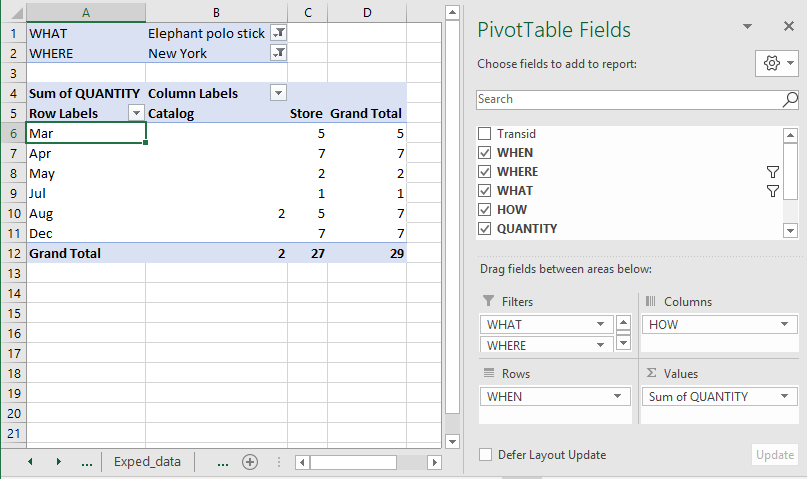{fig-align="center" width="70%"}

- Filter `WHAT` to Elephant polo stick and `WHERE` to New York.
- Group `WHEN` by **Months** in **Rows**.
- Remove `REVENUE` from **Values**, add `QUANTITY`, and confirm that the calculation is **Sum of QUANTITY**. This reports units sold rather than sales value.
- Read the quantities for the months displayed in the PivotTable; do not infer values for months that are absent.

## Summary and announcements

Homework:

- Complete the **Exporter** exercise if it was not finished.
- Complete the **Expeditioner** exercise.

Summarize/review the Excel part, collect questions for the Mid-term exam.

Make sure students are prepared for the typical exam question the Pivot-table creator (giving a list of variables for fields `1`, `2`, `3`, `4`):

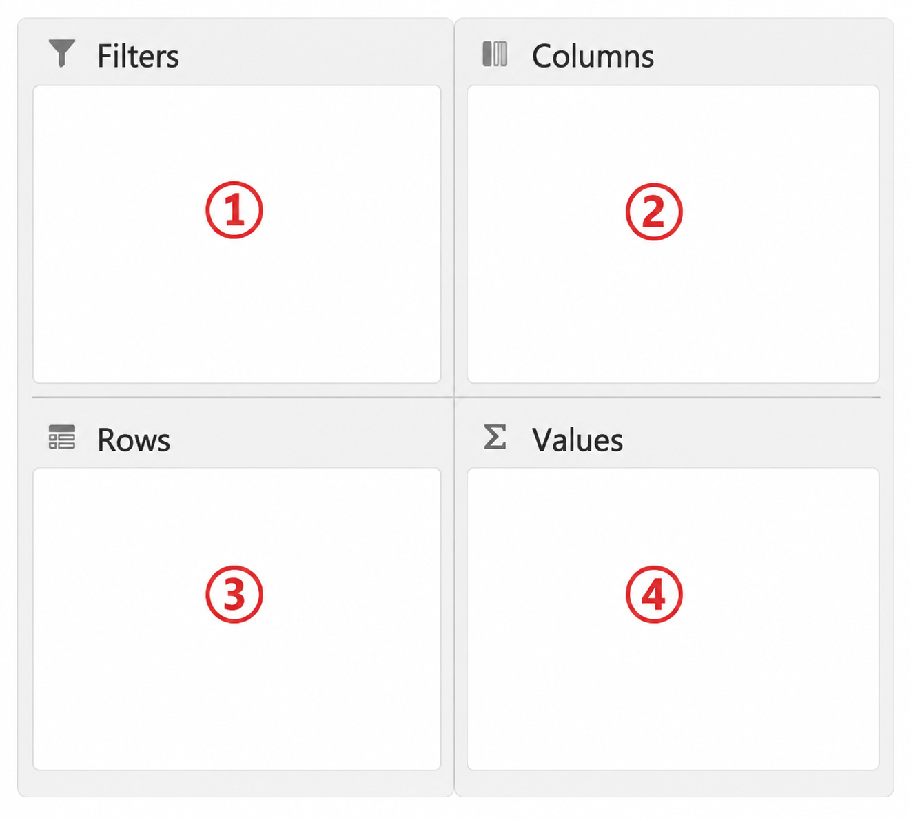{fig-align="center" width="30%"}

Solve Mock exam (we will go through solutions very quickly next time; Solutions will be available on 2026-09-28 on Canvas).

Next session:

- Introduction to Python and pandas.
- Transition from Excel tables and PivotTables to tabular data structures in Python.

::: {.callout-tip title="Prepare and develop Excel skills"}

Revisit the sports analogy: prepare and practice (beyond the exam).
Others will judge your competence by how efficiently you use your sports equipment or the software.
Know how to use your equipment (use shortcuts/prepare cheatsheet).
Maybe you can solve the loan sheet in 1 minute.

See [Excel cheatsheet](../materials/excel-cheat-sheet.pdf).

<!--
https://exceljet.net/shortcuts
https://www.coursera.org/resources/excel-shortcuts-cheat-sheet
-->
:::

::: {.callout-tip title="Notes for improvement"}
Take notes on timing, common errors, unclear instructions, and suitable stopping points on a separate paper and add them to `feedback.qmd` after the session.
:::
