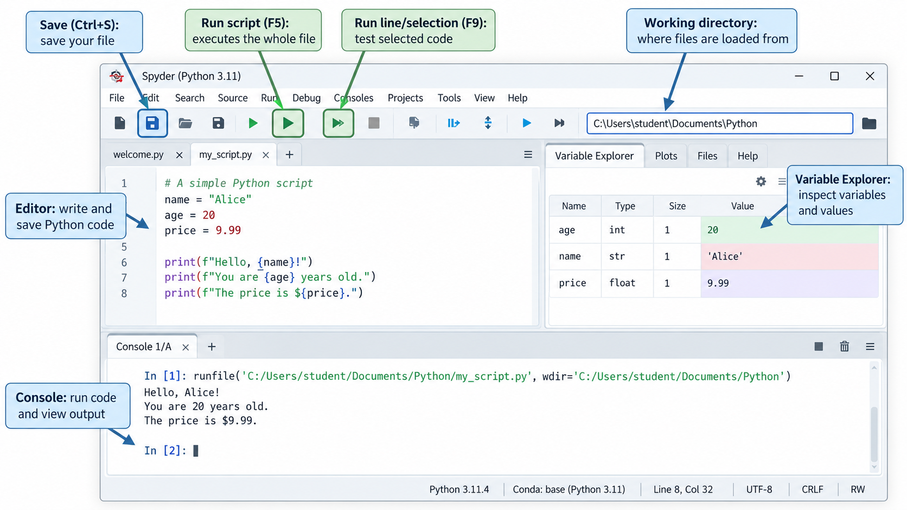

::: {.callout-note title="Preparation"}

TBD/TODO: install Spyder on Fedora machine?


- When distributing `exercises.xlsx` separately, provide students with a zip of `Bikesales.xlsx`, `Bikesales,csv`, `Exped.xlsx`, and `Sales.xlsx`.
- Transfer files to laptop/open environment
- Create a reminder to inform tutors about the exercises that we completed and those that should be discussed in the tutoring sessions
- Open PPTX for animations

:::

| Time      | Topic/activity | Materials |
| --------: | -------------- | --------- |
| 0–15 min  | Python, libraries, scripts, and Spyder | Slides 1–4 |
| 15–30 min | Demo: first Python script | Slide 4; `Spydertest.py` |
| 30–50 min | Arithmetic, strings, and variables | Slides 5–8 |
| 50–65 min | Memory, `print()`, and program output | Slides 9–11 |
| 65–90 min | **Exercises: circle area and future value** | Slide 13; `CircleArea1.py`; `FutureValue.py` |
| **Break** | | |
| 0–15 min  | pandas and imports | Slide 15 |
| 15–35 min | Reading and inspecting Excel data | Slides 16–17; `Bikesales.xlsx` |
| 35–50 min | File paths and CSV input | Slides 18–19 |
| 50–65 min | Loading, previewing, and exporting data | Slide 20; `Exped_Table.xlsx` |
| 65–75 min | DataFrame indexes | Slide 21 |
| 75–90 min | **Exercises: countries and insurance import/export**; unfinished work becomes homework | Slide 22; `countries.py`; `countries.csv`; `insurance.py`; `insurance.xlsx` |

: {tbl-colwidths="[20,40,40]"}

If Python does not work on student machines, a solution may be to use  
<https://peter-rossbach.github.io/Python-Werkstatt/>:

{width=30% fig-align="center"}

For Anaconda: See Canvas instructions:

- `Installing Anaconda for Python_Windows.pdf`
- `Installing Anaconda for Python_Mac.pdf`



## Slide 1 - Introductory discussion

- Discuss why Python complements Excel for advanced analytics, regression, prediction, machine learning, and AI.
- Contrast interpreted and compiled languages.
- Motivate Python through **reusable libraries** and the “don't repeat yourself” principle.
  Don't repeat yourself principle of programming: by using Python libraries (modularization of code), we benefit from the code written by others.
  Illustration (whiteboard): the Python code that is involved in a typical ML studyis roughly 2 million LOC. 99.99% is imported (Pandas, scikitlearn, ...) and a few hundred LOC are our code (tip of the iceberg, we orchestrate existing libraries). For the sake of the argument, we simply ignore all of the other code, the Python core or the code that runs the OS and operates the hardware.
  It is not just LOC, but the 99% of the code (the libraries) are often very well designed and maintained (if you pick the right libraries). Also, they are constantly updated so we get performance improvements, remaining bugs are fixed, and the documentation gets better.
  This means we can really "stand on the shoulders of giants". Pretty amazing.
- On the whiteboard, illustrate an ML study as a small amount of course code built on a much larger body of imported, maintained library code. Emphasize that students orchestrate existing libraries and can “stand on the shoulders of giants.”

<!--
- Ask why students should not simply use ChatGPT: effective prompting still requires validation and improvement.
-->

## Slides 2-4 - Shell, Scripts, IDE

Explain spyder interface:

{width=90% fig-align="center"}

::: {.callout-warning title="Do not work on environment setup in the session"}

If it does not work for some students, ask them to work together with someone where it works.
Setup was supposed to be completed in the first sessions.

:::



## `spydertest.py`

Walk through `spytertest.py` from Canvas with students at the start of the Python session.

```{python}
#| echo: true
#| eval: false

```



## Slide 5 — Basic arithmetic and string operations

Run these expressions individually in Spyder so that each result is visible.

```python
3*5
16-5
16/4
16/5
16%5              # modulo/remainder after integer division (1)
16//5             # floor division: returns whole-number qotient (3)
3**2              # exponent
"Hello " + "World"
```

Note: operators explained on the following slide.

### Slide 8 — Variables and reassignment

Refer to a variable as **names bound to an object**

Python allows a variable to be reassigned to values of different types (dynamic typing), while multiple assignment sets several variables in one statement.

```python
x = 4
x

x = 3.12
x

x = 'hello'
x

a, b = 1, 2
a
b
a + b
```

Highlight multiplication between a string and an integer:

```python
print("haha" * 4)
```

Use an example with `a = 54` to explain that strings and integers cannot be concatenated directly without conversion:

```python
a = 54
print("This number is " + a) # throws an error
print("This number is " + str(a))
```

<!-- Introduce `type(x)` and demonstrate that Python is dynamically typed. -->

## Slide 9 - Variable memory and CPU

Explain step by step how Python approaches this statement.

- Assignment: right side to the variable z.
- Right side is a complex statement. Needs to be evaluated first....

### Slide 10 — Output with `print()`

These examples contrast comma-separated output and string concatenation, demonstrate repetition, use `str()` for conversion, and use `end` to control the line ending.

```python
print('hello')
print('hello', 'there')
print('hello' + ' ' + 'there')
print('haha' * 4)
print(5 * 4)

a = 54
print(a)
print('The number is ' + str(a) + '!')
print('The number is', a, '!')

print('hello ')
print('Peter')
print('hello', end=' ')
print('Peter')
```

## Slide 11 — Predicting program output

Predict the result of each block before running it.

```{python}
x = 15
x = x + 5
print(x)
```
Note: for the `x = x + 5`, the **slide 12** provides an animated explanation.

```{python}
x = 4
y = x + 1
x = 2
print(x, y)
```

```{python}
a = 4.5
b = 2
print(a // b)
```

Note: Floor division returns the largest integer less than or equal to the result.

```{python}
x = 17 / 2 % 2 * 3**3
print(x)
```

Note: Python evaluates according to operator precedence (like in mathematics): first, exponent (\*\*), then the others left-to-right (they have the same precedence).

Example of a **multiple assignment**:

```{python}
x, y = 2, 6
x, y = y, x + 2
print(x, y)
```

```python
a, b = 2, 3
c, b = a, c + 1
print(a, b, c)
```

The final block intentionally raises a `NameError` because `c` is read before it has been assigned.

TODO: is the "parallel assignment" (whats the right name?) really done in parallel or one after the other? could I define a variable in the first statement, which is then used in the second assignment?

## Slide 13 — Basic formula programs

::: {.callout-tip title="Exercises (in-class or homework): Circle"}

```{python}
#| echo: true
#| eval: false

```

:::

::: {.callout-tip title="Exercise (in-class or homework): FutureValue"}

```{python}
#| echo: true
#| eval: false

```

:::

::: {.teaching-break}
☕ Break — 10 minutes
:::

 

## Slide 15 — Importing pandas

Pandas is already installed. We verified it in the spyder setup script.

If we need additional libraries, install them as follows (in a shell):

```sh
pip install pandas
```

pandas DataFrames are widely used to load, inspect, clean, and prepare tabular data for machine learning. Models commonly receive DataFrames (or similar formats) depending on the library.

The short alias `pd` is the conventional name used for pandas (programmers are often lazy and prefer short names).

```python
import pandas as pd
```

### Slide 16 — Reading an Excel file into a DataFrame

**TODO: get and link Bikesales.xlsx file**

Revisit the difference between absolute and relative file paths, referring to the explanation in the preparation booklet.

The final expression displays the DataFrame in an interactive environment.

```python
data = pd.read_excel('Bikesales.xlsx')
data
```

### Slide 17 — Inspecting a DataFrame

These expressions show the DataFrame dimensions, column names, and column data types.

```python
data.shape
list(data)
data.dtypes
```

Consider using:

```python
data.columns
```

instead of:

```python
list(data)
```

 

## Slide 18 — Working directory and file paths

This path is machine-specific. The raw-string prefix `r` prevents Windows backslashes from being interpreted as escape sequences.

**TODO: select a suitable path here:**

```python
import os
os.chdir(r'D:\Dropbox\Lehre\Introduction to Programming\Presentation')
```

Note:

```python
import os

print(os.getcwd())
```

**TODO: where is it in spyder?**

### Slide 19 — Reading CSV files

The relative path is resolved against the active working directory.

```python
data = pd.read_csv('Bikesales.csv')
```

### Slide 20 — Loading, previewing, and exporting data

::: {.teaching-file}
[`../materials/Exped_Table.xlsx`](../materials/Exped_Table.xlsx){.teaching-button .teaching-button-exercise}
:::

`head()` previews the first rows; `index=False` avoids writing the DataFrame index as an extra CSV column.

```python
os.chdir(r'D:\Dropbox\Lehre\Introduction to Programming\Presentation')
exped = pd.read_excel('Exped.xlsx')
exped.head()

exped.to_csv('Exped.csv', index=False)
```

## Slide 21 — Setting a DataFrame index

**TODO: think: should Transid be an incrementing index? in this case, it does not differ from the default/artificial index... It may be a more reasonable example if the new index differs from the one created by default.**

After `set_index()`, `Transid` supplies the row labels.

```python
exped1 = exped
exped1 = exped1.set_index('Transid')
exped1.head()
```



## Slide 22 — Importing and exporting data

::: {.teaching-file}
[In-class exercise]{.teaching-label .teaching-label-exercise} [`../materials/data/countries.csv`](../materials/data/countries.csv){.teaching-button .teaching-button-exercise}
:::

<!-- ../materials/session_04/countries.py -->

```{python}
#| echo: true
#| eval: true

```

### Exercise

::: {.teaching-file}
[In-class exercise]{.teaching-label .teaching-label-exercise} [`../materials/data/insurance.xlsx`](../materials/data/insurance.xlsx){.teaching-button .teaching-button-exercise}
:::

<!-- ../materials/session_04/insurance.py -->

```{python}
#| echo: true
#| eval: true

```

- Complete all exercises as time permits.
- If time is short, assign unfinished exercises as homework.
- Python solutions will be discussed by the tutors.

## Summary and announcements

::: {.callout-tip title="Notes for improvement"}
Take notes on improvements and common questions during the session and add them to `feedback.qmd` afterwards.
:::
