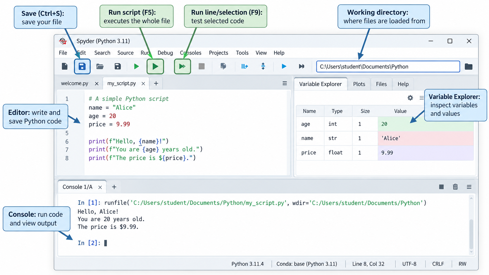

::: {.callout-note title="Preparation"}

- Install Spyder on the machine and run `Spydersetup.py` (Note: students already completed `Spydersetup.py` in the setup sessions!)
- Before the pandas exercises, introduce the `data.zip` archive available in Canvas. Confirm that students have extracted its datasets into a `data/` folder.
- Transfer files to laptop/open environment
- Create a reminder to inform tutors about the exercises that we completed and those that should be discussed in the tutoring sessions
- Open PPTX for animations
- Inform students about recent materials (e.g., List of relevant Excel functions; Mock exam solutions)
:::

| Time      | Topic/activity | Materials |
| --------: | -------------- | --------- |
| 0–15 min  | Python, libraries, scripts, and Spyder | Slides 1–4 |
| 15–30 min | Demo: first Python script | Slide 4; `Spydertest.py` |
| 30–50 min | Arithmetic, strings, and variables | Slides 5–8 |
| 50–65 min | Memory, `print()`, and program output | Slides 9–11 |
| 65–90 min | **Exercises: circle area and future value** | Slide 13; `CircleArea1.py`; `FutureValue.py` |
| **Break** | | |
| 0–15 min  | pandas and imports | Slide 15 |
| 15–35 min | Reading and inspecting Excel data | Slides 16–17; `Bikesales.xlsx` |
| 35–50 min | File paths and CSV input | Slides 18–19 |
| 50–65 min | Loading, previewing, and exporting data | Slide 20; `Exped.xlsx` |
| 65–75 min | DataFrame indexes | Slide 21 |
| 75–90 min | **Exercises: countries and insurance import/export**; unfinished work becomes homework | Slide 22; `countries.py`; `countries.csv`; `insurance.py`; `insurance.xlsx` |

: {tbl-colwidths="[20,40,40]"}

If Python does not work on student machines, a solution may be to use  
<https://peter-rossbach.github.io/Python-Werkstatt/>:

{width=30% fig-align="center"}

For Anaconda: See Canvas instructions:

- `Installing Anaconda for Python_Windows.pdf`
- `Installing Anaconda for Python_Mac.pdf`

## Install packages using Anaconda

Use this sequence in **Anaconda PowerShell Prompt**:

```powershell
# 1. Show environments
conda info --envs

# 2. Activate the environment used by Spyder
conda activate <environment-name>

# 3. Install the package
conda install <package-name>

# Example
conda activate mlbd
conda install inquirer
```

Then restart the Spyder kernel/IDE so it picks up the installed package.



## Slide 1 - Introductory discussion

- Discuss why Python complements Excel for advanced analytics, regression, prediction, machine learning, and AI.
- Contrast interpreted and compiled languages.
- Motivate Python through **reusable libraries** and the “don't repeat yourself” principle.
  Don't repeat yourself principle of programming: by using Python libraries (modularization of code), we benefit from the code written by others.
  Illustration (whiteboard): the Python code that is involved in a typical ML study is roughly 2 million LOC. 99.99% is imported (Pandas, scikitlearn, ...) and a few hundred LOC are our code (tip of the iceberg, we orchestrate existing libraries). For the sake of the argument, we simply ignore all of the other code, the Python core or the code that runs the OS and operates the hardware.
  It is not just LOC, but the 99% of the code (the libraries) are often very well designed and maintained (if you pick the right libraries). Also, they are constantly updated so we get performance improvements, remaining bugs are fixed, and the documentation gets better.
  This means we can really "stand on the shoulders of giants". Pretty amazing.
- On the whiteboard, illustrate an ML study as a small amount of course code built on a much larger body of imported, maintained library code. Emphasize that students orchestrate existing libraries and can “stand on the shoulders of giants.”

Show PyPI website; `pandas` project (popularity, commits, develoeprs, tests)

<!--
- Ask why students should not simply use ChatGPT: effective prompting still requires validation and improvement.
-->

## Slides 2-4 - Shell, Scripts, IDE

Explain spyder interface:

{width=90% fig-align="center"}

::: {.callout-note title="Spyder working directory"}
For the exercises, work from the `materials/` directory and keep this as Spyder's **current working directory**.

Spyder may otherwise change the working directory when running a script (especially an unsaved script). To prevent this, open **Tools → Preferences → Run** and configure the working directory to use the **current working directory**, rather than the directory of the file being executed.

:::


::: {.callout-warning title="Do not work on environment setup in the session"}

If it does not work for some students, ask them to work together with someone where it works.
Setup was supposed to be completed in the first sessions.

:::



## Quick Walk through: `spytertest.py` (Canvas) at the start of the session





## Slide 5 — Basic arithmetic and string operations

Run these expressions individually in Spyder so that each result is visible.

```python
3*5
16-5
16/4
16/5
16%5              # modulo/remainder after integer division (1)
16//5             # floor division: returns whole-number qotient (3)
3**2              # exponent
"Hello " + "World"
```

Note: operators explained on the following slide.

### Slide 8 — Variables and reassignment

Refer to a variable as **names bound to an object**

Python allows a variable to be reassigned to values of different types (**dynamic typing**), while **multiple assignment** sets several variables in one statement.

```python
x = 4
x

x = 3.12
x

x = 'hello'
x

a, b = 1, 2
a
b
a + b
```

Highlight multiplication between a string and an integer:

```python
print("haha" * 4)
```

Use an example with `a = 54` to explain that strings and integers cannot be concatenated directly without conversion:

```python
a = 54
print("This number is " + a)         # throws an error
print("This number is " + str(a))    # solution: explicit type conversion
```

<!-- Introduce `type(x)` and demonstrate that Python is dynamically typed. -->

## Slide 9 - Variable memory and CPU

Explain step by step how Python approaches this statement.

- Assignment: right side to the variable z.
- Right side is a complex statement. Needs to be evaluated first....

### Slide 10 — Output with `print()`

::: {.callout-tip}
Point students towards the tooltips provided in Spyder when typing `print(` in editor or console.
Read and try parameters `end`, `sep`.
Then point to the slides.
:::

These examples contrast comma-separated output and string concatenation, demonstrate repetition, use `str()` for conversion, and use `end` to control the line ending.

```python
print('hello')
print('hello', 'there')
print('hello' + ' ' + 'there')
print('haha' * 4)
print(5 * 4)

a = 54
print(a)
print('The number is ' + str(a) + '!')
print('The number is', a, '!')

print('hello ')
print('Peter')
print('hello', end=' ')
print('Peter')
```

## Slide 11 — Predicting program output

Predict the result of each block before running it.

```{python}
x = 15
x = x + 5
print(x)
```
Note: for the `x = x + 5`, the **slide 12** provides an animated explanation.

```{python}
x = 4
y = x + 1
x = 2
print(x, y)
```

```{python}
a = 4.5
b = 2
print(a // b)
```

Note: Floor division returns the largest integer less than or equal to the result.

```{python}
x = 17 / 2 % 2 * 3**3
print(x)
```

Note: Python evaluates according to operator precedence (like in mathematics): first, exponent (\*\*), then the others left-to-right (they have the same precedence).
**Illustrate this by iteratively replacing results and verifying whether the result stays the same.**

Example of a **multiple assignment**:

```{python}
x, y = 2, 6
x, y = y, x + 2
print(x, y)
```

```python
a, b = 2, 3
c, b = a, c + 1
print(a, b, c)
```

The final block intentionally raises a `NameError` because `c` is read before it has been assigned.

::: {.callout-tip title="Important learning"}
Multiple assignments retrieve variables and complete calculations simultaneously.
There is a difference between the two:

```python
c, b = a, c+1
# and 
c = a
b = c+1
# The second will not raise an error!
```
:::

## Slide 13 — Basic formula programs

::: {.callout-tip title="Exercises (in-class or homework): Circle"}



:::

::: {.callout-tip title="Exercise (in-class or homework): FutureValue"}



:::

::: {.callout-warning title="Typical error"}

```python
future_value = investment(...)**...
# leaving out "*" raises an int not callable.
# patterns like `name()` are interpreted as function calls (like `print()`)

```

:::

::: {.teaching-break}
Break — 10 minutes
:::

 

::: {.callout-important title="Student errors"}
In this part, students typicall need assistance in setting up the working directory.

- Clarify expectation: this takes time, we will do it together
- Give a clear example (my directory, store all files and scripts, how to select it as the working directory in Spyder)
- Script must be stored in the working directory (check/compare!), otherwise, Spyder will automatically set the working directory to the directory of the script
- Ask students to help each other
- Announce the exercise (p.22) early, explain `data.head()`, etc., and be available to help with setup afterwards. 
- Praise for perseverence
:::

## Slide 15 — Importing pandas

Pandas is already installed. We verified it in the spyder setup script.

pandas DataFrames are widely used to load, inspect, clean, and prepare tabular data for machine learning. Models commonly receive DataFrames (or similar formats) depending on the library.

The short alias `pd` is the conventional name used for pandas (programmers are often lazy and prefer short names).

```python
import pandas as pd
```

### Slide 16 — Reading an Excel file into a DataFrame

::: {.teaching-file}
[`../materials/data/Bikesales.xlsx`](../materials/data/Bikesales.xlsx){.teaching-button .teaching-button-exercise}
:::

::: {.callout-important title="Required datasets"}
Download `data.zip` from Canvas and extract its files into a `data/` folder. The archive contains `Bikesales.csv`, `Bikesales.xlsx`, `Exped.xlsx`, and `Sales.xlsx`.
:::

The `Bikesales.xlsx` file used below is provided in Canvas as part of `data.zip`.

The final expression displays the DataFrame in an interactive environment.

```python
data = pd.read_excel("data/Bikesales.xlsx")
data
```

 

## Slide 18 — Working directory and file paths

::: {.callout-important title="Working directory"}
During classroom demonstrations, the instructor selects the repository's `materials/` directory as the working directory in Spyder. A **relative file path** is interpreted relative to the current working directory, which can be selected in Spyder and is not necessarily the directory containing the Python script currently open in the editor.

Students should select their own working directory—for example, the folder containing their downloaded course materials—and adapt relative paths to their own folder structure. If they reproduce the course folder structure and select its parent `materials/` directory, the example paths work without modification. They should not copy an instructor-specific absolute path.
:::

Check the active working directory with:

```python
import os
print(os.getcwd())
```

With `materials/` selected in Spyder, the instructor can use:

```python
import pandas as pd
data = pd.read_excel("data/Bikesales.xlsx")
```

**Windows**: The raw-string prefix `r` prevents backslashes from being interpreted as escape sequences:

```python
os.chdir(r'D:\Dropbox\Lehre\Introduction to Programming\Presentation')
```

### Slide 17 — Inspecting a DataFrame

These expressions show the DataFrame dimensions, column names, and column data types.

```python
data.shape
list(data)
data.dtypes
```

### Slide 19 — Reading CSV files

The relative path is resolved against the active working directory. `Bikesales.csv` is in the archive's `data/` folder.

```python
data = pd.read_csv("data/Bikesales.csv")
```

### Slide 20 — Loading, previewing, and exporting data

::: {.teaching-file}
[`../materials/data/Exped.xlsx`](../materials/data/Exped.xlsx){.teaching-button .teaching-button-exercise}
:::

`Exped.xlsx` is included in the Canvas `data.zip` archive. `head()` previews the first rows; `index=False` avoids writing the DataFrame index as an extra CSV column. Generated files go in `outputs/`, separate from input data.

```python
import os

exped = pd.read_excel("data/Exped.xlsx")
exped.head()

exped.to_csv("outputs/Exped.csv", index=False)
```

## Slide 21 — Setting a DataFrame index

After `set_index()`, `Transid` supplies the row labels.

```python
exped1 = exped
exped1 = exped1.set_index('Transid')
exped1.head()
```



## Slide 22 — Importing and exporting data

::: {.teaching-file}
[In-class exercise]{.teaching-label .teaching-label-exercise} [`../materials/data/countries.csv`](../materials/data/countries.csv){.teaching-button .teaching-button-exercise}
:::



### Exercise

::: {.teaching-file}
[In-class exercise]{.teaching-label .teaching-label-exercise} [`../materials/data/insurance.xlsx`](../materials/data/insurance.xlsx){.teaching-button .teaching-button-exercise}
:::



- Complete all exercises as time permits.
- If time is short, assign unfinished exercises as homework.
- Python solutions will be discussed by the tutors.

## Summary and announcements

::: {.callout-tip title="Notes for improvement"}
Take notes on improvements and common questions during the session and add them to `feedback.qmd` afterwards.
:::
