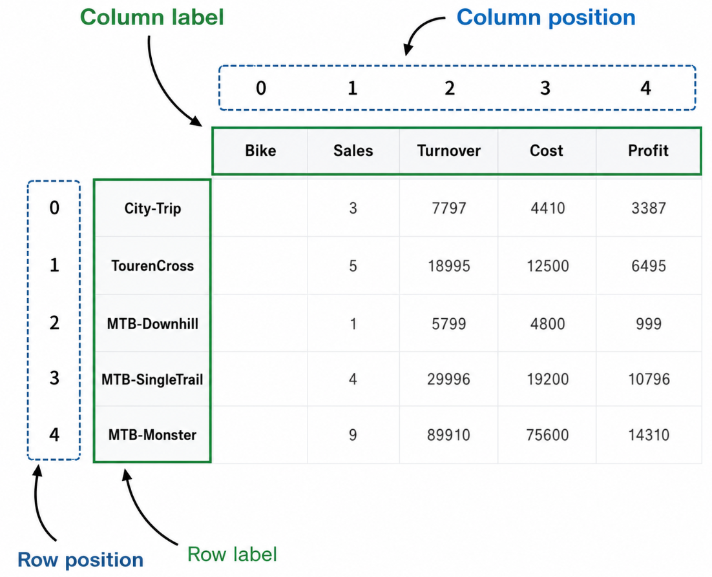

Resources:

- [Good explanation](https://proclusacademy.com/blog/practical/slice-pandas-dataframes-using-iloc-loc/)
- [Kaggle exercise](https://www.kaggle.com/learn/pandas?trk=public_profile_certification-title)
- [pandas tutorial](https://pandas.pydata.org/pandas-docs/stable/getting_started/intro_tutorials/03_subset_data.html)

TODO: illustrate Excel structured references (if they are helpful to understand)?
TBD: illustrate label and index-based access in Python or on the whiteboard?

Note: `exped` corresponds to dataset `Exped_tabls.xls`. `data` corresponds to `Bikestore.xlsx`.

TODO/TBD: start by explaining label/position-based access based on a whiteboard illustration (leverage similarities to Excel. Run the operations in parallel (**but make sure the results are identical with the illustration**))
See: https://chatgpt.com/c/6a6758fc-2954-83eb-a108-c91f378dfc7c

{fig-align="center" width="80%"}

## Slide 23 — Accessing a column

Both forms select one column, but bracket notation is more general because it works with any column name.

```python
exped['WHERE']
exped.WHERE
```

## Slide 24 — Label-based selection with `loc`

`loc` selects by row and column labels. The final expression selects rows using a condition applied to the `Turnover` column.

```python
data.loc[1:3, :]
data.loc[1:3]
data.loc[1:3, 'Turnover']
data.loc[1:3, ['Bike', 'Turnover']]
data.loc[1:3, 'Bike':'Turnover']
data.loc[[1, 3, 6], 'Bike':'Turnover']
data.loc[data.Turnover > 23000, :]
```

## Slide 25 — Selecting rows with `loc`

Selecting a single row label returns one row, whereas a label slice selects multiple rows (including the ending label).

```python
exped.loc[0]
exped.loc[0:2]
exped.loc[1, ['WHERE', 'WHAT', 'HOW']]
exped.loc[1:3, ['WHEN', 'WHERE']]
```

## Slide 26 — Position-based selection with `iloc`

`iloc` uses zero-based integer positions. Negative positions count from the end, and the end of a slice is excluded.

```python
data.iloc[0, 1]
data.iloc[:, 0]
data.iloc[1:3, 1]
data.iloc[:, -2]
data.iloc[-1, :]
data.iloc[[0, 2], [1, 2]]
data.iloc[[0, 2], 1:3]
```

## Slide 27 — One versus multiple rows with `iloc`

Selecting one row generally returns a Series, whereas selecting a range returns a DataFrame.

```python
exped.iloc[0]
exped.iloc[0:2]
```

## Slide 28 — Comparing `loc` and `iloc`

`loc` uses labels and includes the ending label; `iloc` uses integer positions and excludes the ending position.

```python
data.loc[1:3, 'Bike':'Turnover']
data.iloc[1:3, [0, 2]]

exped.loc[1:3, 'WHEN':'WHERE']
exped.iloc[1:3, 1:2]
```

## Slide 29 — Labels after sorting

After sorting, `loc` still follows labels rather than the rows' current physical positions.

```python
data_sorted = data.sort_values(by='Turnover')
data_sorted

data_sorted.loc[1:3, 'Bike':'Turnover']
```

## Slide 30 - Accessing data: loc vs. iloc


Highlight that the iloc (red) is fixed.
The loc (blue) may change its positions.

<!-- see also: https://proclusacademy.com/blog/practical/slice-pandas-dataframes-using-iloc-loc/ -->

## Slide 31 — DataFrame selection

::: {.teaching-file}
[In-class exercise]{.teaching-label .teaching-label-exercise} [`../materials/data/countries.csv`](../materials/data/countries.csv){.teaching-button .teaching-button-exercise}
:::

::: {.teaching-file}
[In-class exercise]{.teaching-label .teaching-label-exercise} [`../materials/session_05/countries1.py`](../materials/session_05/countries1.py){.teaching-button .teaching-button-exercise}
:::

```{python}
#| echo: true
#| eval: false

```

- Guide students through selecting columns and rows with `iloc` and `loc`.

::: {.teaching-break}
☕ Break — 10 minutes
:::

## Slide 32 — Adding rows and columns

Rows can use named or numeric labels. Values may be supplied manually, while new columns can also be calculated from existing columns.

```python
data.loc['bike5'] = ['Gravelbike', 4, 14000, 9000]
data.loc[len(data)] = ['Gravelbike', 4, 14000, 9000]

data.loc[:, 'Profit'] = [3387, 6495, 999, 10796, 14310]
data['Profit'] = data.Turnover - data.Cost
data['Gross_turnover'] = data.Turnover * 1.19
```

## Slide 34 — Deleting rows and columns

`drop()` returns a changed DataFrame, so its result is assigned back to `data`. The default `axis=0` removes rows; `axis=1` removes columns.

```python
data = data.drop('bike5')
data = data.drop(5)

data = data.drop('Profit', axis=1)
data = data.drop('Gross_turnover', axis=1)
```

## Slide 35 — Sorting and useful DataFrame functions

`sort_values()` can sort by one column or by several columns in priority order. `len()` counts rows, while `pct_change()` calculates proportional change from one row to the next.

```python
data_sorted = data.sort_values(by='Turnover')
data_sorted

data_sorted = data.sort_values(
    by=['Sales', 'Turnover'],
    ascending=False,
)
data_sorted

len(exped)

data['Cost'].pct_change()
```

## Slide 36 — Modifying and sorting data

::: {.teaching-file}
[In-class exercise]{.teaching-label .teaching-label-exercise} [`../materials/data/countries.csv`](../materials/data/countries.csv){.teaching-button .teaching-button-exercise}
:::

::: {.teaching-file}
[In-class exercise]{.teaching-label .teaching-label-exercise} [`../materials/session_05/countries2.py`](../materials/session_05/countries2.py){.teaching-button .teaching-button-exercise}
:::

```{python}
#| echo: true
#| eval: false

```

- Use the exercise sequence to add, sort, calculate, and then remove data.

## Summary and announcements

- TODO

::: {.callout-tip title="Notes for improvement"}
Take notes on improvements and common questions during the session and add them to `feedback.qmd` afterwards.
:::
