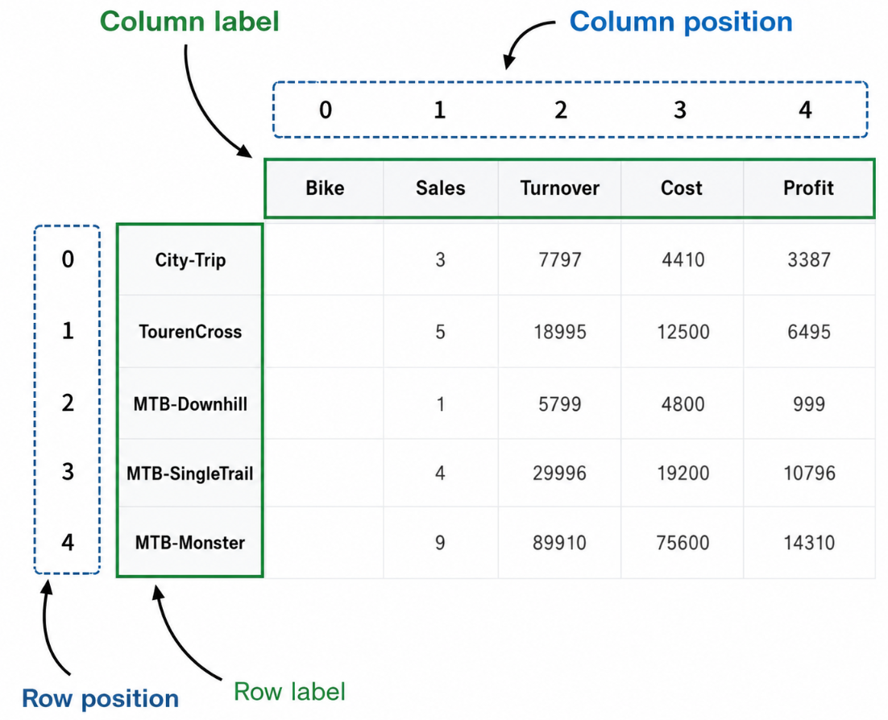
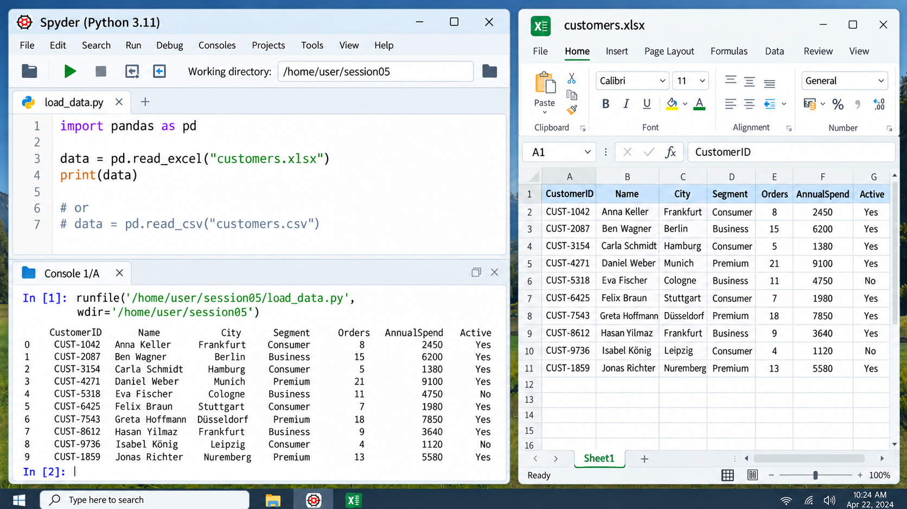

## Preparation

- Upoad the `customers.xlsx`
- Make `customers.xlsx` available on presentation laptop

```{mermaid}
%%| fig-width: 5

flowchart

  subgraph RIGHT["<b>Modify and sort data</b>"]
    direction TB
    B1["<b>Add rows/columns</b> (25 min)"]
    B2["<b>Delete rows/columns</b> (15 min)"]
    B3["<b>Sort and DataFrame functions</b> (20 min)"]
    B4["<b>💻 Modify and sort</b> (25 min)<br/>countries.csv, countries2.py"]

    B1 --> B2 --> B3 --> B4
  end

  subgraph LEFT["<b>Access data</b>"]
    direction TB
    A1["<b>Recap: working directories and opening files</b> (10 min)"]
    A2["<b>iloc: introduction and illustration</b> (20 min)"]
    A3["<b>loc: introduction and illustration</b> (20 min)"]
    A4["<b>💻 loc and iloc exercise</b> (40 min)<br/>countries.csv, countries1.py"]

    A1 --> A2 --> A3 --> A4
  end

```



## Working directories and paths

Checklist for :

- **File explorer:** Put the Python script and the Excel/CSV file in **folder X**.
- **Set Spyder to folder X:** In Spyder, set the **working directory** in the top-right directory field to folder X.
- **Open the script** from this same folder and verify that its path points to X.
- **Match**: use `read_excel()` to read and Excel file, `read_csv()` to read a CSV file.
- **Load with a relative path:** Run the script using only the filename:

```python
import pandas as pd

data = pd.read_excel("data.xlsx")
# or
data = pd.read_csv("data.csv")
```

**Check:** If this works, the working directory and file locations are set up correctly.

Another way to check the working directory:

```python
import os
os.getcwd()
```

::: {.callout-warning}
- Upon running a script, Spyder changes the working directory to the path where the script is saved.
- If you cannot open an Excel/CSV file: fix it later. Work with your neibour.
:::



<!--
::: {.callout-note title="Session 4 datasets"}
`exped` corresponds to `Exped.xlsx`; `data` corresponds to the Bikesales dataset.

The files underlying the `data` and `exped` DataFrames are available in Canvas in `data.zip`. If Spyder or its Python console has been restarted since Session 4, reload the datasets before running these examples.
:::

{width="60%"}
-->

## Setup to explain loc/iloc access

{width="90%"}

The running example is `customers.xlsx`.

```python
customers = pd.read_excel('customers.xlsx')
```

## Slide 26 — Position-based selection with `iloc` (integer location) {#slide-26}

`iloc` selects values based on their position in the dataframe.

This is conceptually similar to referring to cells by their position in Excel.
However, Python starts counting at **0 rather than 1**.

First, try to access what we might intuitively consider the first cell:

```python
customers.iloc[1, 1]
```

This does **not** return the first cell. Both row and column positions start at 0:

```python
customers.iloc[0, 0]
```

The first argument identifies the row position and the second identifies the column position.

```python
customers.iloc[0, :]    # first row, all columns
customers.iloc[:, 0]    # all rows, first column
```

The colon `:` means "all positions" along that dimension.



## Slide 27 — Ranges and other `iloc` selections {#slide-27}

As elsewhere in Python, ranges include the starting position but exclude the ending position.

For example, positions 2–4 correspond to the **3rd through 5th rows**:

```python
customers.iloc[2:5, :]
# Note: last element (5) is exclusive!
```

The same syntax can be used for columns:

```python
customers.iloc[:, 1:4]
```

Negative positions count backwards from the end:

```python
customers.iloc[:, -1]    # last column
customers.iloc[:, -2]    # second-to-last column
customers.iloc[-1, :]    # last row
```

Specific positions can also be supplied as lists:

```python
customers.iloc[[0, 1, 2, 3, 4], [0, 3]]
```

Or ranges and lists can be combined:

```python
customers.iloc[0:5, [0, 3]]
```

This selects the first five rows and columns at positions 0 and 3.



::: {.callout-tip title="Why positions can be fragile"}

`iloc` always refers to the **current position** of rows and columns.

Suppose we want to send a goodie to the two customers who are currently inactive.
Looking at the dataframe, they are currently in positions 4 and 8:

```python
goodie_customers = customers.iloc[[4, 8], :]
goodie_customers
```

This works as long as the structure of the file remains exactly the same.

Imagine saving the script and leaving for lunch.

While we are away, somebody else edits `customers.xlsx`:

- the customers are sorted differently;
- an additional customer may be added;
- columns may be inserted or rearranged.

After returning, we run exactly the same command:

```python
customers = pd.read_excel('customers.xlsx')

goodie_customers = customers.iloc[[4, 8], :]
goodie_customers
```

The command still runs, but it may now select **different customers or columns**.

The positions have changed.

**Transition:** If observations and variables have meaningful names, it is usually safer to access them using these labels instead.

:::



## Slide 23 — Accessing columns by name {#slide-23}

We have already seen that columns have names.

They can be inspected using:

```python
customers.columns
```

A single column can be selected directly by its name:

```python
customers['City']
```

Multiple columns can also be selected:

```python
customers[['Name', 'City']]
```

Column names therefore already provide a label-based way of accessing data.

For rows, pandas can use meaningful labels as well.



## Slide 24 — Giving rows meaningful labels {#slide-24}

Our dataset contains a natural identifier for every observation: `CustomerID`.

We can tell pandas to use this variable as the row index when reading the file:

```python
customers = pd.read_excel(
    'customers.xlsx',
    index_col='CustomerID'
)
```

Inspect the row labels:

```python
customers.index
```

The dataframe now has two kinds of meaningful labels:

- row labels such as `CUST-1042`;
- column labels such as `Name`, `City`, and `AnnualSpend`.

`loc` uses these labels rather than integer positions.

```python
customers.loc['CUST-1042', :]
```

Select one variable for this customer:

```python
customers.loc['CUST-1042', 'Name']
```

Select particular columns:

```python
customers.loc[
    'CUST-1042',
    ['Name', 'City', 'AnnualSpend']
]
```



## Slide 25 — Selecting with `loc` {#slide-25}

`loc` follows the same basic structure as `iloc`:

```text
dataframe.loc[rows, columns]
```

The difference is that the arguments are **labels rather than positions**.

Select all customers and one column:

```python
customers.loc[:, 'City']
```

Select several customers and columns:

```python
customers.loc[
    ['CUST-1042', 'CUST-4271'],
    ['Name', 'City']
]
```

Label ranges are also possible:

```python
customers.loc[
    'CUST-1042':'CUST-4271',
    'Name':'Segment'
]
```

Unlike `iloc`, the ending label is included.

Therefore, both select four rows and three columns in the current dataframe:

```python
customers.iloc[0:4, 1:4]
customers.loc[
    'CUST-1042':'CUST-4271',
    'Name':'Segment'
]
```

Note that label slices select everything **between the two labels in the current index order**.
For robust identification of particular observations, explicit labels or conditions are preferable.



## Slide 24/25 — Condition-based selection with `loc`

Often we do not know the identifiers of the observations we want beforehand.

Instead, we identify them using a condition.

For example, select all inactive customers:

```python
customers.loc[customers['Active'] == 'No', :]
```

Or select only the information needed for sending the goodie:

```python
goodie_customers = customers.loc[
    customers['Active'] == 'No',
    ['Name', 'City']
]
goodie_customers
```

This expresses what we actually want:

> Select the customers whose `Active` value is `No`.

It does not depend on knowing their current positions.



## Slide 29 — Labels remain meaningful after sorting {#slide-29}

Consider one particular customer:

```python
customers.loc[
    'CUST-5318',
    ['Name', 'AnnualSpend', 'Active']
]
```

Now change the order of the dataframe:

```python
customers = customers.sort_values(by='AnnualSpend')
customers
```

The customer's position has changed.

But the same label still identifies the same customer:

```python
customers.loc[
    'CUST-5318',
    ['Name', 'AnnualSpend', 'Active']
]
```

The condition-based goodie selection also continues to work:

```python
customers.loc[
    customers['Active'] == 'No',
    ['Name', 'City']
]
```

This is the central distinction:

**`iloc` follows positions; `loc` follows labels.**



## Slide 28 — Comparing `loc` and `iloc` {#slide-28}

Both methods use the structure

```text
dataframe[rows, columns]
```

but interpret the arguments differently.

`iloc` uses integer positions:

```python
customers.iloc[0, 1]
customers.iloc[0:4, 1:4]
```

`loc` uses labels:

```python
customers.loc['CUST-1042', 'Name']

customers.loc[
    'CUST-1042':'CUST-4271',
    'Name':'Segment'
]
```

::: {.callout-warning title="Important difference: Ranges in iloc vs. loc"}

There is also an important difference for ranges:

- `iloc[0:4]` includes positions 0, 1, 2, and 3;
- `loc['CUST-1042':'CUST-4271']` includes both named endpoints.

:::



## Slide 29/30 — What if we do not specify a row index?

Compare reading the same file in two ways.

First, use `CustomerID` as the row index:

```python
customers = pd.read_excel(
    'customers.xlsx',
    index_col='CustomerID'
)
customers
customers.index
```

Now read the file without specifying an index:

```python
customers_default = pd.read_excel('customers.xlsx')
customers_default
customers_default.index
```

If we do not specify an index, pandas creates labels such as:

```text
0, 1, 2, 3, ...
```

This can make `loc` and `iloc` initially look very similar:

```python
customers_default.loc[0]
customers_default.iloc[0]
```

Both currently return the first row.

However, they still mean different things:

- `loc[0]` means: select the row whose **label is 0**;
- `iloc[0]` means: select the row currently in the **first position**.

The difference becomes visible after changing the row order:

```python
customers_default = customers_default.sort_values(
    by='AnnualSpend'
)

customers_default.loc[0]
customers_default.iloc[0]
```

The automatically generated integer index is therefore a special case in which
labels happen to look like positions.

For datasets with meaningful identifiers such as `CustomerID`, using these
identifiers as the index makes the distinction much clearer.



## Slide 31 — DataFrame selection

::: {.teaching-file}
[`../materials/data/countries.csv`](../materials/data/countries.csv){.teaching-button .teaching-button-exercise}
:::



- Guide students through selecting columns and rows with `iloc` and `loc`.

::: {.teaching-break}
Break — 10 minutes
:::



## Discuss solution of `contries1.py` exercise (> Previous page)

## Slide 32 — Adding rows and columns

Rows can be added using a new row label. Because `CustomerID` is our index, we can use the identifier of the new customer directly.

```python
customers.loc['CUST-9999'] = [
    'Alex Miller',
    'Frankfurt',
    'Business',
    12000,
    'Yes'
]
customers
```

Using a dictionary makes clear which value belongs to which column and does not depend on the current column order.

We can also create new columns from existing information. For example, convert annual spending into an approximate monthly value:

```python
customers['MonthlySpend'] = customers['AnnualSpend'] / 12
```

Or create a column with the same value for every customer:

```python
customers['Country'] = 'Germany'
```

The important distinction is that `.loc[...]` can add a **row**, whereas assigning to `customers['...']` adds or replaces a **column**.



## Slide 34 — Deleting rows and columns

`drop()` removes rows or columns by their labels.

Remove the customer we just added:

```python
customers = customers.drop('CUST-9999')
```

Because rows are the default (`axis=0`), we do not need to specify an axis.

To remove one of our newly created columns:

```python
customers = customers.drop('MonthlySpend', axis=1)
customers = customers.drop('Country', axis=1)
```

Here, `axis=1` tells pandas that the labels refer to columns rather than rows.

`drop()` normally returns a modified DataFrame rather than changing `customers` automatically. We therefore assign the result back to `customers`.



## Slide 35 — Sorting and useful DataFrame functions

We can sort customers according to one variable. For example, sort from lowest to highest annual spending:

```python
customers_sorted = customers.sort_values(
    by='AnnualSpend'
)

customers_sorted
```

To show the highest-spending customers first:

```python
customers_sorted = customers.sort_values(
    by='AnnualSpend',
    ascending=False
)

customers_sorted
```

Several columns can be used as sorting priorities:

```python
customers_sorted = customers.sort_values(
    by=['Segment', 'AnnualSpend'],
    ascending=[True, False]
)

customers_sorted
```

This first groups customers by `Segment` and then orders customers within each segment from highest to lowest annual spending.



## Slide 36 — Modifying and sorting data

::: {.teaching-file}
[`../materials/data/countries.csv`](../materials/data/countries.csv){.teaching-button .teaching-button-exercise}
:::





## Summary and announcements

**Questions for the Excel exam?**

::: {.callout-tip title="Notes for improvement"}
Take notes on improvements and common questions during the session and add them to `feedback.qmd` afterwards.
:::
